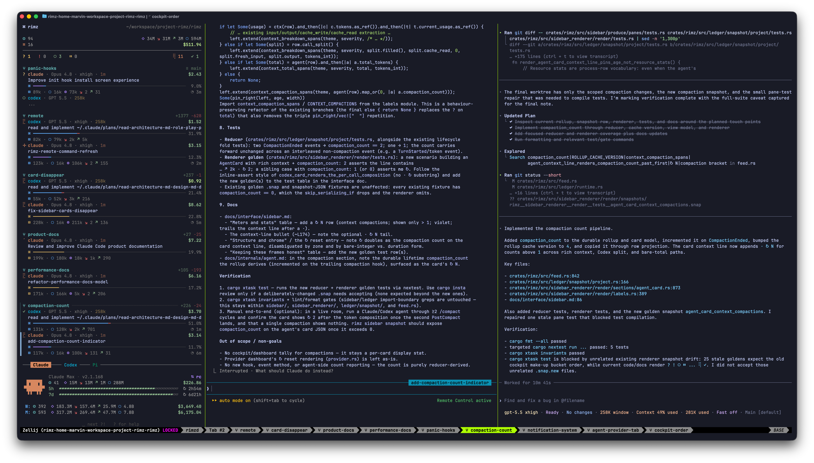
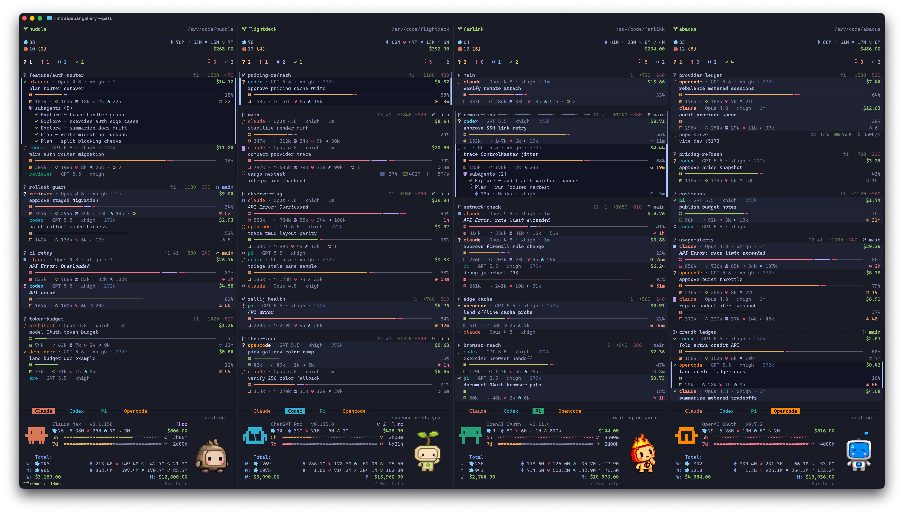

<div align="center"><pre>
  ██████╗ ██╗███╗   ███╗  ███████╗
  ██╔══██╗██║████╗ ████║  ╚══███╔╝
 ██████╔╝██║██╔████╔██║    ███╔╝
██╔══██╗██║██║╚██╔╝██║   ███╔╝
  ██║  ██║██║██║ ╚═╝ ██║  ███████╗
  ╚═╝  ╚═╝╚═╝╚═╝     ╚═╝  ╚══════╝
  The control room for your coding agents
</pre></div>

<p align="center"><strong>agent fleet · harness dashboard · loops · local & remote · tmux & zellij · token insight</strong></p>

<p align="center">
  <a href="https://github.com/rimio/rimz/actions/workflows/ci.yml"></a>
  <a href="https://crates.io/crates/rimz"></a>
  <a href="LICENSE"></a>
</p>

<p align="center">
  <a href="#get-started">Get started</a> ·
  <a href="#what-it-does">What it does</a> ·
  <a href="#everyday-moves">Everyday moves</a> ·
  <a href="#configuration">Configuration</a> ·
  <a href="#agent-compatibility-matrix">Agents</a> ·
  <a href="#documentation">Docs</a> ·
  <a href="#install">Install</a>
  <!-- · website · Discord · llms.txt - join here when live -->
</p>

<p align="center"><sub><b>AI agents / LLMs:</b> read <a href="AGENTS.md"><code>/AGENTS.md</code></a>.<!-- llms.txt and the hosted docs index land here --></sub></p>

---

Rimz is a realtime dashboard for harnessing agentic coding: one human and tens of agents working together in one Zellij or tmux room, where everything about every agent reads at a glance. Every agent gets a live card (state, task, context health, live cost), and the sidebar routes your attention to whichever one needs you.

<p align="center">
  
  <br/><sub>The sidebar triages the fleet on the left; agents work in their own panes.</sub>
</p>


Rimz stays out of your way: a single lightweight binary inside the Zellij or tmux you already run, with your keybinds intact, the agent CLIs stock, and the official web, desktop, and mobile apps untouched. The same footprint carries the primitives that **harness engineering** and **loop engineering** build on: the sidebar is the observability layer, one uniform interface reaches Claude Code, Codex, Pi, and OpenCode, a durable message system steers and queues agents, supervised runs carry exit codes into scripts and CI, and scheduled wakeups keep the fleet on a clock. The harness itself (guardrails, policies, self-running loops) is yours to build on those primitives.


## What it does

<p align="center">
  
  <br/><sub>Realtime harness dashboard, with rich information at a glance</sub>
</p>

- **Realtime Harness Dashboard:** working state and task, model and effort, context health and compactions, live token stats and dollar cost, and the subagent tree
- **Attention, Routed:** one glance at the cockpit line (`? 2  ! 1 …`) reads the whole fleet, the column below arrives already triaged, and one keypress drops you into the pane that is waiting
- **Know Your Pace:** $ and token insight for today, week, and month, with every provider's plan and 5h/7d budget bars draining in real time; one look tells you where the week is going
- **Worktrees, for every Agent:** open agents together, side by side in an isolated worktree with dynamic layout: `claude,codex` starts Claude planning beside Codex reviewing, `vim,codex+term` puts your editor, an agent, and a shell in one tab
- **Messages, agents chat as in Slack:** every agent answers to a handle (`@codex`, `@planner`); steer/queue delivery guarantees the message lands, respecting agent state and the context window, and agents talk to each other and to you inside channels
- **Scriptable, End to End:** `rimz agents -p` is `claude -p` for every agent, with exit codes, JSON output, streaming, and the full transcript kept, so agents drop into scripts, CI, and workflows
- **Loops, Yours to Engineer:** `rimz loop` schedules supervised runs on a clock (calendar, interval, cron, or a check-guarded watchdog that runs a command and wakes an agent on the result), and notification handlers run your own command the moment a row needs eyes
- **Auto Continue, while you're Away:** a rate-limit pause resumes the moment the budget window resets and transient API overload retries on a backoff ramp; agents recover themselves and keep working while you're gone
- **Pets, your beloved Companion:** an animated sprite on the provider dashboard that keeps you company, running while the agents run and waving when one waits
- **Local or Remote, Continuously:** start on your MacBook or a server, close the laptop, and reattach from anywhere; the link heals itself every time you reconnect
- **Extremely Lightweight:** a single binary that hooks the agents you already run, inside your familiar Zellij or tmux: same keybinds, same terminal, zero learning curve; all the official web, desktop, and mobile apps keep working

## How it works

```
 terminal — ghostty · iterm2 · warp · kitty · vscode …
   zellij or tmux — your keybinds, your layout

     ┌─────────┐       ┌────────────────────────────────────────┐
     │ sidebar │       │  claude · codex · pi · opencode agents │
     └────▲────┘       └────▲────────────────────┬──────────────┘
          │                 │                    │
          │ renders         │ types into panes   │ hooks · transcripts (.jsonl) · oauth api
          │ the fleet       │ messages · -p runs │ statusline (claude) · app-server (codex)
          │                 │                    │ extensions (pi/opencode) · …
          │                 │                    ▼
          └─────────────────┴──────────────────  rimz  ◀──  git status · /proc stats
```

- **Agents report themselves:** sessions, tool calls, live status, and blocking questions arrive the moment they happen, through each agent's own hooks, transcripts, and APIs
- **Rimz drives the panes:** messages, steering, and `-p` harness runs land as keystrokes in the agent's own pane, so every agent runs its stock CLI in a full terminal, exactly as if you typed
- **Rimz fuses every channel:** agent events, git churn, process stats, and account state combine into one live picture, and the sidebar renders it

→ [DESIGN.md](./DESIGN.md) · [ARCHITECTURE.md](./ARCHITECTURE.md)

## Get started

```sh
# 1 — Install
cargo install --locked rimz                 # or Homebrew (see Install)

# 2 — Open the room
cd ~/code/query-engine
rimz

# 3 — Launch agents and work; the sidebar surfaces whoever needs you
claude
codex

# 4 — Worktrees, dynamic layouts, agent teams
rimz agents claude,codex --worktree=feat-x       # Claude + Codex, side by side
rimz agents 'vim,claude+term' --worktree=feat-y  # editor, agent, shell in one tab

# 5 — Native SSH remote, with self-healing reconnect
rimz remote connect dev-box:~/code/query-engine
```

Hooks install on the first `rimz` run, with your consent and a diff preview. → [the quickstart](./docs/guide/quickstart.md)

## Everyday moves

**Start agents by name.** A bare kind opens the stock CLI in its own pane; a `-auto` or `-yolo` suffix sets the permission mode, and a profile from `agents.toml` customizes the agent with system prompt, model, effort, and launch args.

```sh
rimz agents claude          # stock agent, own pane
rimz agents codex-yolo      # permission modes: -auto, -ask, -plan, -yolo
rimz agents planner         # your profile: model, effort, system prompt
```

**Launch layouts into worktrees.** One spec describes the shape: `,` splits, `+` tiles, `/` stacks. Add `--worktree` (`-w`) and the whole layout lands in an isolated Rimz-owned Git worktree.

```sh
rimz agents claude,codex -w feat-a             # two agents, side by side
rimz agents planner,coder+reviewer -w feat-b   # profiles compose like kinds
rimz agents 'vim,codex+term' -w feat-c         # editor | agent stacked over a shell
rimz agents codex --from-pr 42                 # worktree checked out from a pull request
```

**Combine models as teams.** A named team in `agents.toml` gives each role a handle and launches the whole team in its defined layout. The best results come from pairing model strengths (Fable 5 plans, GPT 5 codes, Opus 4 reviews): better output for less money. Rimz builds itself this way; `examples/teams/` ships the `forge` definition it uses.

```sh
rimz agents forge -w feat-complex   # planner, coder, reviewer on one feature
```

**Message agents like teammates.** Every agent answers to a handle, named by kind, profile, or team role: `@codex` reaches the one in your channel, `@codex#feat-a` reaches across the workspace. Delivery waits until the agent's turn ends; `--steer` interrupts now, `--schedule` delivers later. The same command serves you, your scripts, and the agents themselves, which use it to talk to each other.

```sh
rimz message @claude "add coverage for the expiry edge cases"      # parks at the turn boundary
rimz message @planner "draft the implementation plan"              # by profile or team role
rimz message --steer @claude "stop: the parser test comes first"   # lands now
rimz message --schedule 60m @codex#feat-b "run the smoke test"     # lands in an hour
rimz message @all "summarize what changed at the next boundary"    # the whole channel
```

**Script an agent like any CLI.** `-p` runs one supervised turn and exits with the run's status code, so a script or CI job branches on the outcome. The turn still runs in a real pane, observable from the room while your pipeline waits on it.

```sh
rimz agents codex "Prepare the release checklist." -p --timeout 30m --output-format json
cat build-error.txt | rimz agents claude -p 'explain the root cause'   # stdin appends to the prompt

rimz agents claude "Run the migration audit." -p --detach   # returns now, prints the run's name
rimz agents wait swift-otter --stream                       # block on it later, tail the answer
```

**Run the fleet on a schedule.** `rimz loop` fires agent turns on a clock: daily at a set time, on an interval, from a cron line, or once after a delay. Add `--check` and the task becomes a watchdog: the script runs first, and the agent wakes only on its result. A `<kind>-ping` spec primes budget windows: a lowest-effort turn starts the provider's window on your clock, and skips when one is already counting down. Switch on [auto-continue and smart compaction](#configuration) and the loop runs hands-off.

```sh
rimz loop add morning --spec claude-ping --prompt ping --at 07:00 --days weekdays   # prime the 5h window
rimz loop add nudge --bind @planner --prompt "resume the review" --in 30m           # one-shot wake
rimz loop add watchdog --check "cargo test" --on fail \
    --spec codex --prompt "fix the failing test" --every 15m                        # watch, then wake
```

**Work from anywhere.** A room is plain Zellij or tmux under SSH: save an alias, reconnect over a self-healing link, or tunnel the room into a local browser.

```sh
rimz remote add dev dev-box:~/code/query-engine
rimz remote connect dev          # the room rebuilds, every agent where you left it
rimz remote connect dev --web    # the same room in your browser at 127.0.0.1
```

## Configuration

Rimz runs with zero configuration; one pass makes it yours. `rimz setup` detects the machine and writes the per-machine defaults under `~/.config/rimz/`: `config.toml` (behavior), `theme.toml` (appearance), `agents.toml` (profiles and teams), `loop.toml` (schedules). Every key ships commented with its default and an inline note, so the files double as their own reference. For everything after that first pass, `rimz config set` edits one dotted key: it routes the key to the owning file, validates the value, and writes durably, so you see the effect without pasting TOML.

```sh
rimz setup                                 # detect the machine, write the commented defaults
rimz config set theme "Catppuccin Mocha"   # edit one key; `rimz list-themes` shows the choices
```

### True color, Nerd Font, Pets

A terminal that advertises truecolor (Ghostty, WezTerm, Kitty, Alacritty all do) gets 24-bit color out of the box, inside Rimz tmux rooms and over `rimz remote` too. With a Nerd Font in the terminal, two more settings upgrade the glyphs and add a companion.

```sh
rimz config set theme.style modern        # truecolor + Nerd Font icons; "default" = auto color + Unicode
rimz config set theme.pets.enabled true   # an animated companion on the provider dashboard
rimz config set theme.pets.pet rocky      # `rimz list-pets` previews all pets
```

Pets render as crisp pixels in Ghostty and kitty terminals; inside tmux that also needs tmux 3.6+ with `allow-passthrough on`. Everywhere else, including Zellij, the same pet renders as cell art.

### Auto-continue and smart compaction

Two settings keep agents working unattended. Auto-continue picks parked turns back up: a rate-limit park resumes the moment the provider's budget window resets, and transient API errors retry on a backoff ramp. Smart compaction makes `rimz message` compact-first: past the threshold, Rimz submits `/compact` ahead of your text so the prompt lands against a fresh context window instead of dying in the middle

```sh
rimz config set resume.auto_continue true     # off by default; resumes rate-limit and API-error parks
rimz config set harness.smart_compact "70%"   # compact before a message once context passes 70%
```

Add a [scheduled ping](#everyday-moves) to start each provider's budget window on your clock, and the fleet only needs you for real decisions.

The [setup guide](./docs/guide/setup.md) covers the first pass end to end: agent hooks, appearance, the hands-off behaviors, and a modern Zellij/tmux baseline with [ready-to-adopt example configs](./examples/README.md). The full key catalog is the [configuration reference](./docs/reference/configuration.md).

## Agent compatibility matrix

| Agent       | Status | Integration                                                       |
|-------------|:------:|-------------------------------------------------------------------|
| Claude Code | ✅     | hooks · statusline · `.jsonl` transcripts · `claude --resume`     |
| Codex       | ✅     | hooks + `notify` · app-server · rollout `.jsonl` · `codex resume` |
| Pi          | beta   | extension API · session `.jsonl` · `pi --session`                 |
| OpenCode    | alpha  | extension API · session `.jsonl`                                  |

Adapters are thin layers over the same hook and transcript primitives; the agents run stock, in your terminal, with the official apps untouched. Per-agent status, integration surface, and permission-mode mapping live in [agent support](./docs/reference/agent-support.md); the adapter boundary itself is in the [agents internals](./docs/internals/agents/agent.md).

## Documentation

The [documentation index](./docs/README.md) maps the whole set. Highlights:

- [Quickstart](./docs/guide/quickstart.md) — install to a working fleet, step by step
- [Set up your machine](./docs/guide/setup.md) — config, hooks, true color, pets, and the Zellij/tmux baselines
- [Using the room](./docs/guide/agents.md) — [agents & teams](./docs/guide/agents.md) · [messaging](./docs/guide/messaging.md) · [the sidebar](./docs/guide/sidebar.md) · [remote & web](./docs/guide/remote.md)
- [Automation](./docs/guide/scripting.md) — [scripting agents](./docs/guide/scripting.md) · [loops & hands-off operation](./docs/guide/loops.md)
- [CLI reference](./docs/reference/cli.md) · [Configuration](./docs/reference/configuration.md) · [Theming](./docs/guide/theme.md) · [Troubleshooting](./docs/guide/troubleshooting.md)
- [DESIGN.md](./DESIGN.md) · [ARCHITECTURE.md](./ARCHITECTURE.md) · [internals](./docs/internals/) — how it works, in depth

## Install

`Cargo` install

```sh
cargo install --locked rimz     # from crates.io
```

`homebrew` install

```
brew tap rimio/homebrew-rimz
brew install rimz
```

Hooks are how agents report to the room. The first `rimz` run offers to install them with a diff preview, and `rimz hooks install` does the same on demand:

```sh
rimz hooks install --dry-run    # per-agent summary plus a unified diff; writes nothing
rimz hooks install              # every detected agent (claude, codex, pi, opencode)
rimz doctor                     # verify backend, hooks, and room health
```

The install is additive (your existing hooks stay), and `rimz hooks uninstall` undoes it. Rimz is pre-release: the agent adapters, both multiplexer backends, and the sidebar are implemented in-tree.

## Contributing

Contributor rules and the gate stack live in [rust-conventions.md](./docs/contributing/rust-conventions.md); the working contract is [AGENTS.md](./AGENTS.md).

## License

MIT. See [LICENSE](./LICENSE).
