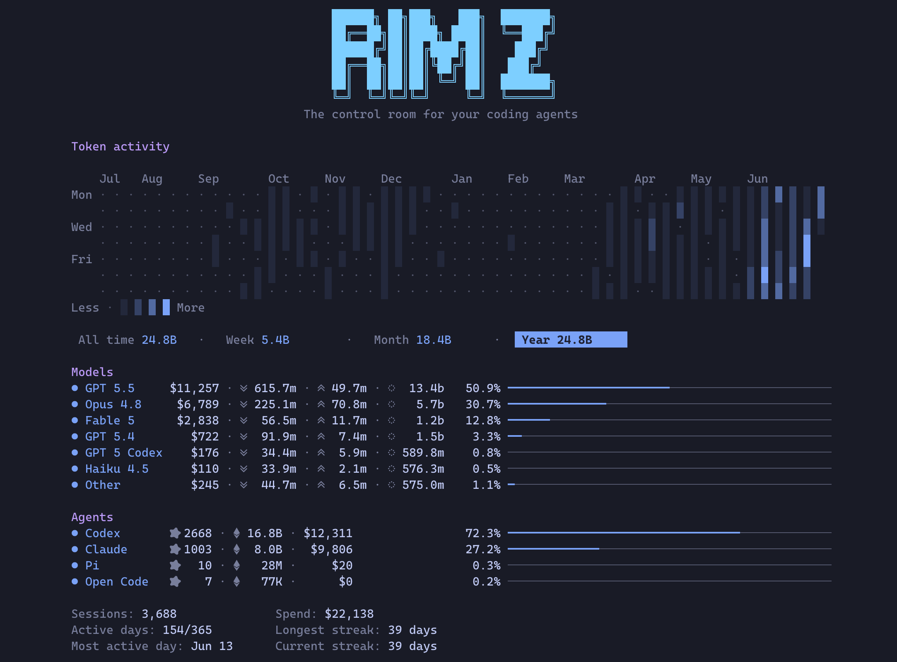

# Token Insight

You run a fleet now, not a single agent, and the fleet spends. Tokens turn into dollars across every provider you use, and each keeps its own tally on its own billing page: none beside your code, none aware of the others. The one number you actually want, what the fleet cost and how hard it worked, is the one nobody puts in front of you.

Token insight is that number, in the terminal. Every turn your agents run leaves a transcript on disk (the model, the token counts, the timestamps, and for some providers the dollar cost), and RimZ reads those files and rolls them into one account-global picture across Claude, Codex, Pi, and OpenCode. If you have run `ccusage` over Claude's transcripts, this is the same trick, widened to every provider and wired into the room so it updates as the work lands. It is also just satisfying to watch: the totals are a fair read on how much your agents are doing for you, and there is nothing to switch on, since the hooks you approved at install already point RimZ at the files.

You read it two ways. `rimz stats` prints the whole history on demand, from anywhere. The sidebar keeps a live slice of the same data in front of you while you work.

<p align="center">
  
  <br/><sub><code>rimz stats</code>: a year of token activity, then where it went by model and by agent.</sub>
</p>

## The full picture: rimz stats

`rimz stats` prints your account-global history: a heatmap of daily token use, the totals for a chosen window, and where the spend went by model and by agent. It reads the same data as the sidebar, so it runs inside a room or anywhere else on the machine, in or out of a project.

- **The heatmap** is a GitHub-style contribution graph of tokens per day, about a year of history, shaded from an idle day up to your heaviest. The scale is relative to your own busiest day in view, so the texture reads against your rhythm rather than an absolute ceiling. `--dollars` shades it by cost instead of tokens.
- **The window row** (All time, Week, Month, Year) scopes the Models, Agents, and insight rows below it, while the heatmap stays full-history. In the held dashboard, `Tab` and `Shift-Tab` cycle the window; a plain `rimz stats` prints the All-time view.
- **Models** ranks where the dollars went, each model under its friendly name (`gpt-5.5` reads as `GPT 5.5`) with its token split and its share of the window; the long tail folds into one `Other` row. **Agents** ranks by session count across Claude, Codex, Pi, and OpenCode. Both breakdowns carry tokens as well as dollars, so a model RimZ cannot price still shows up with its tokens counted.
- **The insight lines** close it: sessions and spend for the window, how many days in the window saw activity, your heaviest single day, and your longest and current active-day streaks.

For a shell or a script, `rimz stats --json` emits the per-day buckets, the windows, both breakdowns, and the insights. `rimz stats --refresh` instead holds the panel open and repaints it every minute; this is the live pane the `rimzd` daemon view carries.

`rimz stats` only reads. It touches no agent, writes nothing to your sessions, and prints from a cache RimZ keeps under its own state directory. Its one network call is the weekly price-table refresh described below, which `RIMZ_PRICING_OFFLINE=1` turns off.

## In the sidebar, live

The sidebar keeps two live slices of the same numbers in view while you work: the provider dashboard breaks your spend down by account, and the cockpit scopes it to the room you are standing in.

### The marks you read everywhere

Spend and tokens speak one small vocabulary across `rimz stats`, the provider dashboard, and the cockpit. Learn it once:

| mark | reads as |
|------|----------|
| `◎` | sessions: the distinct agent threads that ran in the window |
| `◇` | total tokens |
| `↘` | input tokens, with cache writes folded in |
| `↗` | output tokens |
| `◌` | cache-read tokens: context re-read from the provider's cache |
| `$` | dollar spend, in green |

Cache reads are usually most of the volume, so a busy day is mostly `◌`. The complete glyph legend, with every meter and tone, is the [interface reference](../interface/sidebar.md#reading-the-glyphs).

### Per account: the provider dashboard

Pinned to the bottom of the sidebar is one block per provider account, because a budget belongs to the login, not to any single agent. Each block names the account and plan, the CLI version, that provider's spend, and the account's budget:

```
  Claude v2.1.169 · Claude Max                    ⇅ rc
  ▐▛███▜▌  ◎ 53  ◇ 16M ↘ 13M ↗ 2M ◌ 198M       $188.88
 ▝▜█████▛▘ 5h ▰▰▰▰▰▰▰▰▰▰▰▰▰▰▰▰▰▰▰▰▰▰▰▰▰▰▱▱▱▱   ↻ 1h47m
   ▘▘ ▝▝   7d ▰▰▰▰▰▰▰▰▰▰▰▰▰▰▰▰▰▰▰▰▰▰▰▰▰▰▱▱▱▱   ↻ 5d22h
```

The stats row is this provider's spend for the headline window: sessions, the token breakdown, and dollars pinned right. Two totals rows then close the dashboard, summing every provider across the trailing week and month:

```
  W: ◎ 420  ◇ 202.9M ↘ 175.1M ↗ 27.8M ◌  5.2B $3,888.88
  M: ◎ 860  ◇ 420.0M ↘ 366.0M ↗ 54.0M ◌ 10.8B $8,666.66
```

These totals are account-global, like `rimz stats`: they count every project on the machine, so one glance tells you where the week is going regardless of which room you are in.

#### Budget is not spend

The `5h` and `7d` bars measure a different thing from the dollar figures. They are the included budget of your subscription plan, draining toward the reset printed beside them (`↻ 1h47m`), and they fill with what is left. A plan like Claude Max or ChatGPT Pro refills on those windows automatically, so the bars are your read on pace, not a bill. An API-key account has no such window, so its block shows a single `api` row of trailing-month spend instead.

When a window empties mid-turn the agent parks rather than fails, and with auto-continue it resumes itself the moment the window resets ([loops, built-in recovery](./loops.md#built-in-recovery)). The exact bar tones, the reset colouring, and the not-yet-started window are drawn in the [interface reference](../interface/sidebar.md#zone-3--the-provider-dashboard); where the readings come from is [providers internals](../internals/agents/providers.md).

#### Dollar caps at four scopes

Dollar budgets use one model at four scopes: an agent session (`--budget` or a profile budget), a loop task (`--budget` and `--budget-per-day`), a room fleet (`harness.budget`), and a provider login (`accounts.budget.<kind>`). The room and login caps accept `/day` only, read a dedicated local-calendar-day spend window, and turn on only through their config keys.

Run `rimz budget` to inspect or adjust an armed cap: `20/day` replaces the live room cap, `+10` adds headroom, and `off` disables it; add `--account claude` to target that login. An armed, healthy scope reads exactly like an uncapped one. While agents are parked on a crossed cap, the cockpit or provider row turns alarm-red and explains the stop as `$50.21 of $50/day`.

Crossing any cap parks a running agent through the same interrupt backstop. Agents already at rest keep their lifecycle status, and a waiting agent keeps its ask visible until the answered turn runs again. A human message delivered after the park waives that agent's next turn once, and the waiver is consumed when the turn ends; background delivery stays parked. At the daily reset or after a cap is raised, only agents that RimZ interrupted receive the continue prompt. Supervised `-p` launches and loop fires do not consume waivers: they fail or record `budget skipped` until the room and account scopes have headroom.

### Per room: the cockpit

The top of the sidebar narrows all of this to the room you are standing in. Two lines carry the spend:

```
 ◎ 91                          ◇ 32M ↘ 28M ↗ 3M ◌ 472M    ← sessions · token breakdown
 ¤ 16 (2)                                      $420.00    ← live agents · unread · spend
```

The token breakdown sums every session that ran in the room's spend window, and the dollar figure below it is the room's cost for that same window, counting up in an eased roll the moment any agent's cost moves. Both are scoped to this room: the project root and the worktrees grouped under it, never your whole machine.

The window is yours to set with `[sidebar] spend_window` ([configuration](./configuration.md#sidebar-rendering)):

- `session` (the default): the current burst of work, opened by your latest activity after a five-hour idle gap. Loop-fired turns count inside it but never start it.
- `24h`: a trailing twenty-four hours.
- `today`: since calendar midnight in your configured `timezone`.

To read one agent's cost instead of the room's, [`rimz agents show`](./agents.md#manage-a-running-room) prints that session's token split and dollar total.

## How the numbers are calculated

Every figure on every surface comes from one place: the transcript and session files your agents already write to disk. RimZ never scrapes a pane or guesses from the screen. It reads the same records the provider's own CLI wrote, so the token counts are the provider's, not an estimate.

Turning tokens into dollars is where the care goes:

- Providers that log a dollar cost per turn (Pi, and older Claude transcripts) are taken at their word.
- Providers that log token counts (Claude, Codex) are priced with a per-model table. RimZ ships a built-in table and refreshes it weekly from the public LiteLLM price list, so a new model's rate lands without waiting on a RimZ release. Input, output, cache writes, and cache reads each price at their own rate, including the higher tier some models charge above 200k tokens.
- A model RimZ has no price for still contributes its tokens and its session to every total. Only its dollar column reads zero, until a price is found. Token attribution never waits on pricing.

Two scopes and a set of windows keep the surfaces honest:

- The cockpit is scoped to the room you are in. The provider dashboard totals and everything in `rimz stats` are account-global, summed per provider account across every project on the machine.
- The cockpit window is `session`, `24h`, or `today` (above). The dashboard's totals rows are the trailing week and month, `rimz stats` adds year and all-time, and the heatmap buckets by calendar day.

None of this can fail into a wrong-looking number. Spend is enrichment, so a missing binary, a logged-out account, or an unpriced model degrades to a blank or a zero, never a bad figure dressed up as a real one. For the mechanism in full, the caches, the price-table precedence, and the window fusion, see [providers internals](../internals/agents/providers.md).

## Configuration

A few knobs, all plain TOML ([configuration](./configuration.md)):

- `[sidebar] spend_window` picks the cockpit window (`session`, `24h`, `today`), and `timezone` sets the `today` cutoff and the displayed times.
- `[theme.display] max_provider_blocks` and `provider_list` choose how many provider blocks the dashboard shows and in what order. A token-only provider ranks by spend like any other.
- `[accounts.usage_limit_usd]` sets a display ceiling per API-key provider, so its `api` row reads `$used/$limit` instead of `∞`. It tunes the bar only; the provider still enforces the real limit.

## See also

- [The sidebar](./sidebar.md): reading the cockpit and dashboard for attention, not just for spend.
- [Agents](./agents.md#manage-a-running-room): one agent's token split and cost with `rimz agents show`.
- [Loops](./loops.md#built-in-recovery): auto-continue when a budget window empties mid-turn.
- [Configuration](./configuration.md#sidebar-rendering): the spend window, timezone, and provider-display knobs.
- [The sidebar on screen](../interface/sidebar.md#zone-3--the-provider-dashboard): every bar, tone, and glyph drawn exactly.
- [Providers internals](../internals/agents/providers.md): accounts, budgets, spend, and the price table in depth.
