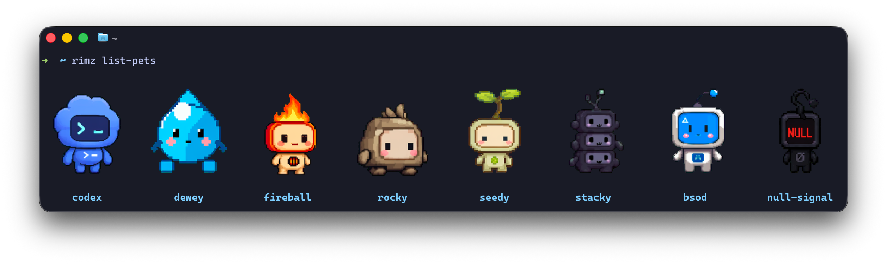
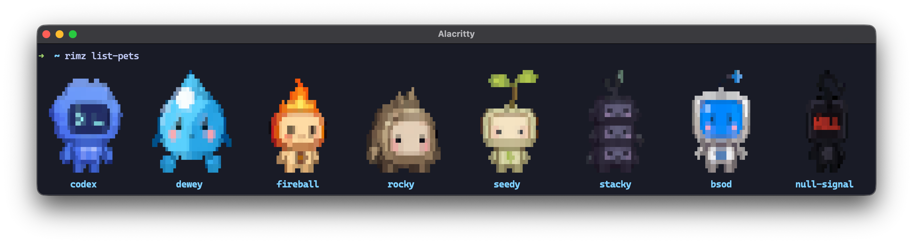

# Pets

The agent cards in the sidebar hold still on purpose: a column that twitched every second would be unreadable at a glance. The cost is that a room can change state without anything catching your eye, so you check the column instead of being called to it. A pet is the deliberate exception. It is a small animated sprite at the bottom of the column, on the [provider dashboard](./sidebar.md#the-provider-dashboard), and it acts out whatever one card above it is doing: waving when an agent wants an answer, resting when everything is caught up. That card is the one you have selected, the card the sidebar highlights and `n` walks you through ([glance, jump, answer](./sidebar.md#glance-jump-answer)). Motion at the bottom of the column means the card you were watching changed.

<p align="center">
  
  <br/><sub><code>rimz list-pets</code> in Ghostty: the built-in pets as crisp pixels.</sub>
</p>

One command turns a pet on, and its opposite turns it off:

```sh
rimz config set theme.pets.enabled true    # the default pet is rocky
rimz config set theme.pets.enabled false
```

Either way that writes one line into `[theme.pets]` in `~/.rimz/theme.toml` and touches nothing else. A running sidebar picks the change up on its next refresh, a second or two later, with no restart.

The sidebar also gets wider, because the pet shares its row with the provider block beside it. Turning one on takes the sidebar's automatic width to 30% of the terminal at any terminal size; a width you set yourself in `[theme.display] width_percent` still wins ([the width ladder](./sidebar.md#setting-the-width)). This one change waits for a room restart, because a running sidebar keeps the width it opened with.

A pet is display and nothing else: it changes what the dashboard paints, never what an agent can do. The setting is yours and per-machine, so it follows you between projects and never travels with a repository. The five `[theme.pets]` keys and their defaults sit in one table in [configuration](./configuration.md#pets).

## What the pet is telling you

The pet acts out the selected card, one steady animation per state. Change which card is selected and the pet follows it.

| Selected card | The pet | Default caption |
| --- | --- | --- |
| an agent compacting its context | reviews | `reviewing context` |
| an agent waiting on your answer | waves | `someone needs you` |
| an agent whose turn failed, or a stuck process | has a rough patch | `rough patch - take a look` |
| an agent paused on a rate limit, or waiting on its own subagent | stands by | `waiting on work` |
| an agent in its reasoning phase | paces back and forth | `thinking it through` |
| an agent otherwise running, or a busy process | runs | `room is moving` |
| an agent idle, finished, or sleeping, or no selection at all | rests | `all caught up` |

The first matching row wins, so an agent compacting while it waits on your answer reviews rather than waves.

The pet jumps once before it settles into a new animation, and that jump is the attention cue worth catching. Two things trigger it: the selected card moving to a different row of the table, and any card in the room turning unread, which is the mark a card picks up when it needs you and keeps until you look ([glance, jump, answer](./sidebar.md#glance-jump-answer)).

The pet moves under the same [animation roles](./theme.md#animations) as the rest of the sidebar, so quieting a role quiets the pet with it. Set one to `effect = "static"` and the states that use it freeze the pet on its first frame, jump included.

The caption under the sprite names the moment. Each state draws from its own pool of at least a hundred lines, so the pet rarely repeats itself, and a caption stands until the state changes rather than flickering line to line. `rimz config set theme.pets.voice false` keeps the animation and drops these lines.

Three other captions appear whether or not `voice` is on: `fetching pet...` while a sheet loads, `pet unavailable` when the last load failed, and `no pet selected` when `theme.pets.pet` is empty.

## Choose a pet

`rimz list-pets` previews every choice as a sprite grid in the terminal, built-ins first, then anything you installed, each labelled with the id to put in `theme.pets.pet`. The eight built-ins are `codex`, `dewey`, `fireball`, `rocky`, `seedy`, `stacky`, `bsod`, and `null-signal`; `rocky` is the default. Piped or with `--json` the command prints ids and loads no sprites ([reference](../reference/cli/config.md#list-pets)).

```sh
rimz config set theme.pets.pet fireball
```

### Pets from petdex.dev

[petdex.dev](https://petdex.dev/) is the public gallery of pets for coding agents: several thousand open-source pixel pets, browsable by collection and previewable in their animation states before you take one. RimZ reads petdex installs directly, so a pet from the gallery is two commands away:

```sh
npx petdex install wall-e                # installs under ~/.codex/pets/wall-e/
rimz config set theme.pets.pet wall-e    # a bare name selects an installed pet
```

An install is a directory holding a `pet.json` manifest beside its sprite sheet. RimZ reads the manifest's `spritesheetPath` field and loads the sheet it names, and any directory laid out that way works wherever it lives, so `rimz config set theme.pets.pet ~/art/my-pets/koi/` reads one by path. A built-in id wins over an installed pet of the same name, so an install called `codex` can only be selected by its directory path.

### Your own sheet

The same key takes your own art:

```sh
rimz config set theme.pets.pet ~/art/my-pet.png                # a sheet on disk
rimz config set theme.pets.pet https://example.com/my-pet.webp # a sheet on the web
```

A local sheet is read straight off disk, with no network request and no copy, and RimZ never deletes a file you point it at. An HTTPS sheet is fetched once and cached; a plain `http://` URL is refused before any request goes out. Either can be a WebP or a PNG. RimZ tells the forms apart by shape: a value containing `/` or `.`, or starting with `~`, is a path, and anything else is a built-in id or an installed petdex name.

Every sheet has the same layout as the petdex ones: a `1536x1872` image holding an `8x9` grid of `192x208` frames, each row one animation. RimZ checks those dimensions before it caches or decodes anything, so a differently sized image fails outright rather than rendering as noise. Which row drives which animation is in the [pets internals](../internals/sidebar/pets.md#from-card-state-to-animation).

## Crisp pixels and cell art

The same sheet draws two ways. RimZ calls them tiers, and which one you get depends on the terminal you are sitting in front of.

The `pixel` tier sends the sprite through the kitty graphics protocol and draws it at the terminal's own resolution. It needs Ghostty or kitty, and inside a tmux room it also needs tmux 3.6 or newer with `allow-passthrough` set to `on` or `all`. A browser tab counts as a qualifying terminal, because the [RimZ browser page](./web.md#browser-appearance-and-input) speaks the same protocol.

The `sextant` tier draws the sprite as cell art, splitting each terminal cell into a 2x3 grid of blocks. It asks nothing of the terminal beyond color, so it works under Zellij, over SSH, on a stock ttyd page, and in any terminal that renders the block characters. Zellij rooms are always on this tier: Zellij does not accept the way RimZ places kitty images, whatever the host terminal supports.

<p align="center">
  
  <br/><sub>The same pets as sextant cell art, here in Alacritty; Zellij rooms render this tier too.</sub>
</p>

`theme.pets.glyphs` picks the tier:

| `glyphs` | Renders |
| --- | --- |
| `auto` (default) | pixels when the terminal and the multiplexer both qualify, otherwise cell art |
| `pixel` | skips the terminal check, for a kitty-compatible terminal RimZ does not know by name; the tmux and Zellij gates still apply |
| `sextant` | cell art everywhere, whatever the terminal can do |

In a tmux room `auto` requires every attached client to qualify, not just yours: each one has to be a Ghostty or kitty terminal, or a browser tab served by RimZ. Attach a plain terminal to the room and the pet drops to cell art within ten seconds; detach it and the pixels come back.

Two things outside `[theme.pets]` override the tier. `[theme.display] pixel = "off"` is the master kitty-graphics switch: it sends pets and the context meter alike back to cell art, whatever `glyphs` asks for ([display](./theme.md#display)). `NO_COLOR` in the environment goes further and drops the sprite entirely, leaving the caption standing alone.

## When the pet looks wrong

**It looks squashed or stretched.** Cell art fits the sprite to your terminal's cell shape, which RimZ reads from the pty when the terminal reports it and otherwise assumes to be about `2.17`. A value you set by hand wins over both: `rimz config set theme.pets.cell_aspect 2.5`, where the value is cell height divided by cell width, anywhere from `1.0` to `4.0`. Pixel pets are unaffected: they draw at the terminal's own resolution and never consult the ratio.

**The caption says `pet unavailable`.** The sheet could not be loaded. For a built-in or an HTTPS pet that usually means the network was down when you switched pets on; RimZ retries by itself every twenty seconds, and the caption clears when one succeeds. For a local or petdex pet, check that the path exists and that the image matches the `1536x1872` shape.

**There is no pet at all.** Pets sit at the right edge of the provider dashboard, so a sidebar too narrow to hold both the provider block and the sprite drops the pet first ([what the dashboard draws](../interface/sidebar.md#pets)). `NO_COLOR` also removes it. If the sidebar itself is missing or the colors are wrong, that is a terminal or multiplexer problem: [troubleshooting](./troubleshooting.md#colors-glyphs-or-pets-dont-render) walks it.

**The mouse pointer flickers on macOS.** Some macOS terminals re-check the pointer shape every time an image updates. RimZ sends each sprite once and refreshes a given sprite at most every two seconds to keep that traffic down; `rimz config set theme.pets.glyphs sextant` removes it completely, because cell art sends no images.

## What leaves your machine

A built-in pet is fetched once over HTTPS from the public Codex pets CDN, and a URL pet from the host you named. Both land under `~/.rimz/cache/pets/`, so a pet is fetched once per machine and every room after that reads it off disk. Petdex installs and local sheets are read from disk and make no request at all.

Set `RIMZ_PETS_OFFLINE` to any value, `0` included, and RimZ serves the cache only: a pet already cached still draws, and one that is not fails as unavailable instead of reaching the network.

The request carries the asset URL and nothing else. Prompts, transcripts, pane text, workspace paths, and provider credentials never travel on this path. A sheet is image data, and RimZ decodes it rather than running anything from it; a `pet.json` manifest holds a path to that image and no commands. The pet's place in the wider threat model is one bullet in [security](./security.md#what-leaves-your-machine), and the cache layout, the timeouts, and the retry policy are in the [pets internals](../internals/sidebar/pets.md#assets).

## See also

- [The sidebar](./sidebar.md): the column the pet lives at the bottom of, and how the dashboard picks a provider.
- [Theming](./theme.md): the palette, glyphs, and animation roles the pet renders under.
- [Configuration](./configuration.md#pets): the `[theme.pets]` keys and their defaults, in one table.
- [Troubleshooting](./troubleshooting.md#colors-glyphs-or-pets-dont-render): a terminal that draws the sidebar wrong, pets included.
