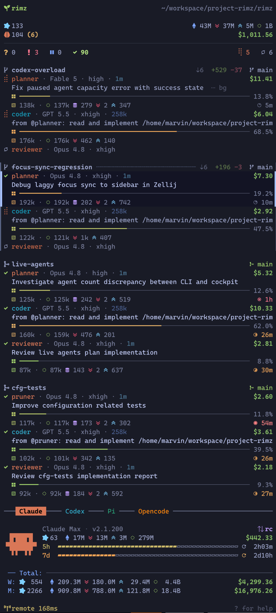

# The sidebar

One person, a fleet of agents, and only so much attention to spend. The sidebar spends it for you: one narrow column beside the agents' panes that answers a single question, **which pane needs you, right now**. Everything on it serves that question or the two behind it: what is the fleet doing, and what is it costing. You never work *in* the sidebar; when it surfaces an agent, one keypress drops you into that agent's pane and you answer in the agent's own UI.

This page is how to read it: the zones and what each shows, the cards and the states behind them, and the ranking that decides what sits on top. Three companions go deeper: the [interface reference](../interface/sidebar.md) draws every glyph, meter, and frame exactly; [theme.md](./theme.md) restyles all of it; [configuration.md](../reference/configuration.md#sidebar-rendering) holds the knobs.

<p align="center">
  
</p>

## The layout

Top to bottom, the column stacks three zones plus pinned chrome:

```
┌───────────────────────────────────────────┐
│ cockpit        the whole fleet summary    │  pinned
├───────────────────────────────────────────┤
│ cards          one card per pane,         │  scrolls
│                grouped by worktree        │
├───────────────────────────────────────────┤
│ provider       accounts, budget,          │  pinned
│                token stats, pets          │
├───────────────────────────────────────────┤
│ footer         help · link health         │  pinned
└───────────────────────────────────────────┘
```

The cockpit and dashboard hold fixed positions, so the numbers you glance at never jump as agents change state; only the cards scroll between them.

### The cockpit

The top block reads the whole room in four lines:

- **Identity.** The workspace name and its path, so a glance confirms which project this room is.
- **Sessions and tokens.** How many agent sessions have run in the configured spend window, with the room's token breakdown pinned right: total, input, output, and cache-read.
- **Live agents and spend.** How many agents are alive right now, an unread count like `(2)` when results or questions await you, and the room's dollar spend rolling up live as agents work.
- **The make-up line.** The fleet by state: `? 3  ! 1  ⏸ 0  ✓ 8` counts who asked you something, who failed, who is parked on a provider limit, and who holds a finished result, with live capacity (`⢿` working, `○` idle) on the right.

A row of zeros with no unread count means nothing needs you, so you can skip the scan entirely. Every non-zero bucket is a click target that filters the cards to that state, and when the agent that most needs you scrolls out of view, an `↑ N need you` banner appears; clicking it brings that card back.

### The agent cards

The body: one card per pane, grouped under the worktree it lives in. A worktree is total isolation, so each group reads as one bounded block, and the group header carries the work's git story: commits ahead and behind the trunk, lines added and removed (uncommitted and untracked work counts too), and a marker for where the work stands, from a plain branch through an open, merged, or closed pull request. Panes outside every project checkout fold into a dim `external` divider at the very bottom.

Cards arrive already triaged (the [ranking below](#how-the-column-is-ordered) decides the order), and a busy worktree caps at six rows with a `+K more` line that only ever hides idle agents and quiet shells, never anything that might need you.

### The provider dashboard

Budgets are account-scoped, one account shared by every session of a provider, so they live in a pinned panel at the bottom rather than on the cards. Each provider block shows the account and plan (`Claude Max`, `ChatGPT Pro`), the CLI version, that provider's session count, token breakdown, and dollar spend, and one draining "mana" bar per budget window (5-hour, 7-day) with a countdown to its reset. API-key accounts show trailing-month spend instead of a window. Below the blocks, two totals rows sum the whole fleet across providers for the trailing week and month, so one look tells you where the week is going.

With several providers the panel tabs, following whichever agent you have selected; `←`/`→` or a click picks one by hand. With [pets enabled](./theme.md#pets), the companion rides the panel's right edge.

### Bottom chrome

The footer holds `? for help`, which opens the key and filter overlay in place. When you have been away, a quiet `zᶻ idle` badge appears; over SSH, a link-health badge shows the round-trip time. If the sidebar ever cannot read the room, a sticky alert takes the bottom line and says so, because a blank column should never masquerade as an empty room.

## The agent card

Each agent is a small stacked card, four lines at rest:

```
⣾ claude · Opus 4.8 · xhigh · 1m                $1.27    ← state · handle · model · effort · window · cost
  store refactor                                         ← what it is working on
  ▣ ━━━━━━━━━━━━━━━━─────────────────────────── 38.2%    ← context meter: how full the window is
  ▤ 76k · ◌ 68k ◍ 6k ↘ 1k ↗ 2k                   ◔ 8m    ← tokens in the window · last activity
```

- **The identity line.** The state glyph leads, animated while the agent works. Then the agent's handle (its team role, profile, or kind, so a team reads `planner` / `coder` / `reviewer`), the model and reasoning effort it runs, and the size of its context window. The session's dollar cost pins right and counts up live once the session has spent anything.
- **What it is working on.** The session's name or task, falling back to its latest prompt so the card stays labelled between turns. When a turn dies on a provider error, this line quotes the error (`API Error: Overloaded`) so the card says why without a jump.
- **The context meter.** How full the agent's context window is, as a bar and a percentage. The fill also shows where the window went: cache reads, cache writes, and fresh input paint as distinct runs, and the bar's tone shifts from calm toward red as the window fills.
- **The token line.** The absolute companion: tokens currently in the window, the same composition as markers, a `↻ N` count of completed context compactions, and, once the agent has been quiet for five minutes, its last-activity age pinned right, heating toward red as an hour approaches.

Selecting a card appends anything deeper without reshaping what is on screen: the **subagents** the agent spawned this turn appear underneath, each with its own live state, what the parent asked it to do, and, while it runs, its token spend, model, and elapsed time. A finished subagent keeps its `✓` or `!` verdict on the list until the parent's next turn. Subagents have no pane of their own, so they appear only here, nested under their parent.

How much of the card shows at rest is yours to tune with `card_density` ([theme.md → Display](./theme.md#display)): `compact` trims resting cards, `expanded` shows subagents everywhere.

## The agent lifecycle

Every card wears one state, reported by the agent itself: Rimz hooks into each agent's own event stream, so the card changes the moment the agent starts a turn, calls a tool, asks a question, or finishes, not when something scrapes a screen. Six states cover the life of a session:

| glyph | state | meaning | needs you |
|-------|-------|---------|-----------|
| `○` | idle | alive, nothing in flight | no |
| `⠁` / `⢿` | running | working a turn: `⠁` while it reads and reasons, `⢿` once it starts editing files | no |
| `?` | waiting | stopped mid-task for your answer: a permission, a plan approval, a question | **yes** |
| `!` | failed | the turn errored, died on a provider API error, or a running agent went silent past the stall window | **yes** |
| `⏸` | paused | stopped mid-turn on a provider rate limit or overload | when it recovers |
| `✓` | done | the turn finished cleanly and holds a result | a look, when convenient |

The full glyph vocabulary, including the transient heads that ride over a running card (compacting, waiting on subagents, parked on background work), is the [interface legend](../interface/sidebar.md#reading-the-glyphs).

A session's life traces one loop through those states:

```
 ●──launch──► idle ──prompt──► running ──┬── clean ──► done
                                 ▲   │   └── error ──► failed
                        answered │   │ asks you: permission,
                                 │   ▼ plan approval, question
                                 └─ waiting
```

- A fresh agent is **idle** until its first prompt; a prompt you type (or a queued `rimz message`) starts a turn.
- A **running** turn opens in the thinking head while the agent reads and plans, and switches to the working spinner at its first file edit; a research turn that never edits stays in the thinking head end to end.
- An **ask pulls the card to `waiting`**, and answering it in the pane returns the agent to work; the card notices the answer even before the turn formally moves on.
- A turn ends **done** or **failed**; either way the agent is ready for its next prompt, and the state tells you whether to collect a result or unblock a problem.

Two states are Rimz's own judgment rather than an agent report. **Paused** is derived: when a turn stops because the provider's budget window is spent or the API is overloaded, the card parks at `⏸` instead of pretending to fail, and with [auto-continue](../reference/configuration.md#resume) enabled it resumes by itself the moment the window resets or the backoff clears. **Stall** is the safety net: a running agent silent past the stall window (30 minutes by default) escalates to `!`, because silence that long usually means something needs a look; a parent quietly waiting on its subagents is exempt.

## Process rows

A pane no agent has claimed (your editor, a shell, a build) renders as a slimmer, quieter row: the program's name, a hollow `○` when idle, a spinner while it does real work, and, for a working pane, its live command plus a CPU, memory, and I/O readout. Process rows sit below the agent cards in their worktree and never enter the cockpit tallies — they never ask for your attention. They are still jump targets, and the moment an agent starts in that pane the row becomes that agent's card.

## Attention: what needs you

An agent earns your attention when you are its blocker or its beneficiary. Four signals carry that, in descending pull:

- **An ask (`?`).** The agent stopped mid-task for your answer. A whole loaded context sits idle and cooling until you reply, so asks carry the most weight.
- **A failure (`!`).** The turn ended in an error, or a running agent has gone silent past the stall window, and the work needs a look before it continues. A failure weighs nearly as much as an ask, so the two interleave by how long each has waited rather than by kind.
- **A park (`⏸`).** The agent stopped mid-turn on a provider limit. The task is blocked, but there is nothing to answer until the limit recovers, so a park ranks below asks and failures and above all calm work.
- **Calm work, ranked by what it offers.** `done` leads the calm states because it holds a result; `running` needs nothing right now; `idle` is spare capacity and reads last, so a freshly launched agent appends at the bottom instead of reshuffling the list.

Only the ask, the failure, and the park call for you. Everything else is context: how the fleet is doing while nothing needs a hand.

### From a glance to the pane

The cockpit compresses the fleet into one line, and the column below arrives already triaged: the card that needs you next sits at the top of its worktree, a soft wash marks every result, ask, and recovery you have not seen, and the one card that most needs you breathes until you read it.

You do not read where to go; you go. Press `n` (or `␣`) to jump to the next thing that needs you, oldest first, and Rimz focuses that agent's pane. The prompt and its safe defaults live in the agent's own UI, where the full context is, so you read and answer there; focusing the pane clears its unread mark, and `N` walks back. The full key table is in [the interface reference](../interface/sidebar.md#jump--the-row-is-the-link).

Glance, jump, answer: that loop is the product. Desktop, bell, and command notifications carry the same cues when you are off-screen ([notifications](../internals/sidebar/notifications.md)), and handlers or loops you wire can clear routine cues before they reach you ([loops and schedules](./loops.md)); the ranking below spends whatever attention is left.

### The unread inbox surfaces in place

A card turns *unread* the moment it enters `waiting`, `failed`, `paused`, or `done`, and stays unread until you focus its pane or mark it read, even after the agent recovers and moves on. The wash and blink mark it, the jump key walks unread rows oldest-actionable-first, and notifications ring it. The card keeps its place in the time and status order while the inbox gets you to it.

## How the column is ordered

Within a worktree, agent cards lead and process rows form a quiet tail. In one line: asks and failures first, interleaved oldest-first, then parked agents, then calm work — done, running, idle. The exact ranking contract lives in [the internals](../internals/sidebar/sidebar.md#attention-ranking-and-the-cap).

### Time reshapes the order

Measured from each card's last activity, in three windows:

1. **Inside the first hour, blocked work climbs.** An ask, failure, or park grows more urgent the longer it waits, so a failure overdue fifty minutes outranks an ask from two minutes ago and blocked work reads oldest-first — the cheapest order to clear. Calm work keeps a flat weight, so live agents hold their place while they run. (The hour matches the agent's prompt-cache lifetime: answer inside it and the agent resumes warm.)
2. **Between one hour and twenty-four, everything cools.** Urgency decays instead of climbing: a stale ask still leads stale calm work, but the whole window sinks beneath anything currently hot, so yesterday's unanswered question stops competing with the agent blocked right now.
3. **Past twenty-four hours, a card sleeps.** It parks in an archive at the back, keeping only its state order, so an archived ask still reads above an archived idle agent.

### Teams read as one

A co-launched team is one line of work, so it holds one contiguous block and takes one state derived from its members: any member asking or failed makes the team **blocked**, else a parked member makes it **paused**, else a running member makes it **working**, else a finished member makes it **done**, else it is **idle**. One blocked member lifts the whole block, so a planner waiting on you blocks its coder and reviewer too, whatever they are doing; a team where one member finished while others still run reads as working, because the team is done only when every member is. The block ranks by that derived state on its oldest blocked member's clock and stays contiguous, so teammates sit side by side in their declared role order.

### Git decides among the calm

Attention always outranks git: a git-backed group with a blocked agent leads whatever its diff looks like. Among git-backed groups whose agents are all calm, the git verdict answers *is this work landed?* **Dirty** leads, because uncommitted changes are unfinished business; **clean** follows, committed but still to land; **done** sinks, because content on trunk or a merged or closed PR with every agent resting means the work is finished. A group with no git verdict sits between clean and done: no evidence of pending work, and no proof it landed.

### The shape that always holds

Two partitions hold regardless of any score, so the column keeps one stable outline:

- **Agent cards lead their worktree; process rows form the tail.** Shells, builds, and servers are context, so they seat below every agent card.
- **Project worktrees lead; out-of-project panes tail.** Panes outside every project checkout fold into the dim `external` divider that always sorts last, keeping an attention-only tally (`? n` / `! n`) so an out-of-project ask still surfaces.

The six-row cap trims only a worktree's idle and process tail. Anything active, blocked, parked, finished, unread, or focused stays visible, so a card that might need you never hides behind the count.

## Tuning

Three `[agents.attention]` knobs move the boundaries: `stalled_after_secs` (a silent agent escalates to `!`, 30 minutes), `inactive_after_secs` (hot work ends, one hour), and `archive_after_secs` (a card sleeps, 24 hours). Details in [configuration.md](../reference/configuration.md#sidebar-rendering).

## See also

- [The sidebar on screen](../interface/sidebar.md) — every glyph, meter, and frame drawn exactly, with the key table.
- [Messaging](./messaging.md) — the other half of the loop: reach the agent the sidebar surfaced.
- [Theming and pets](./theme.md) — restyle the column, its palette, and the companion.
- [Remote](./remote.md) — the link-health badge and the column rebuilt over SSH.
- [Configuration → sidebar rendering](../reference/configuration.md#sidebar-rendering) — the render cadence and attention knobs.
- [Sidebar internals](../internals/sidebar/sidebar.md) — presence, the ranking contract, and reload.
