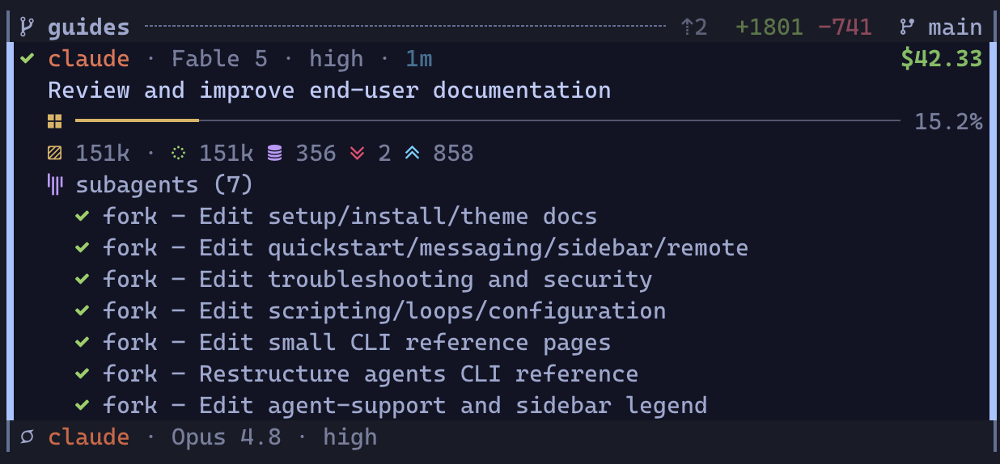

# Sidebar

<p align="center">
  
</p>

Running coding agents today means one conversation per terminal: prompt, watch it run, answer when it stops. Two agents fit in two tabs. Ten do not. Every rotation through the tabs costs a context switch for your head as much as for the terminal: re-read scrollback to tell *thinking* from *waiting on me*, reload what this agent was doing, then find your way back to your own work. Nothing announces a finished turn or a blocking question, so you learn about them whenever you next visit the tab, and until you do, an agent stopped on a permission prompt looks exactly like an agent reasoning.

The sidebar replaces the rotation with a column. One narrow pane beside the agents holds one live card per agent: its state, what it is working on, how full its context window is, what it has cost. A card changes as the agent starts a turn, calls a tool, asks a question, or finishes. One line counts the fleet by state, so a row of zeros means nothing needs you and you can stay where you are. When an agent does need you, its card rises to the top of its group and marks itself unread; press `n` and you are in that agent's pane. Checking becomes a glance, a switch starts with the card's context already read, and finished work waits marked instead of hoping to be noticed.

You never work *in* the sidebar. It has no reply box and no approve button. It routes you to the pane, and you answer in the agent's own UI, where the full prompt and its safe defaults live.

## Why you can trust it

**Agents report themselves.** The reporting hooks you approved when you [installed hooks](./setup.md#install-agent-hooks) fire from inside each agent: session start, tool call, blocking question, turn end. A card changes because the agent said so, and nothing on a card is read off the screen. The single exception is Codex, whose pane RimZ reads to confirm a turn that died. A few states are RimZ's own judgment rather than an agent report, and [the lifecycle](#the-agent-lifecycle) names them.

**The column reads; it does not drive.** It is one pane in your room running a renderer over the durable store those hooks write. Everything it writes is display: which cards you have read, its own heartbeat, and the status suffix on the mux tab names. Jumping focuses a pane exactly as your mux prefix would. Close the pane and every agent keeps working, `rimz sidebar repair` puts the column back, and a card that still needs you is still unread and still ranked when it returns.

RimZ does act on agents from behind the column, in one place and only for the hands-off automation you switched on: auto-continue resumes a parked agent, idle compaction reclaims a stale context, auto-redeem spends a reset credit, and a crossed budget cap parks the work ([keep the fleet moving](./loops.md#keep-the-fleet-moving), [budgets](./budget.md)). Nothing else in the column touches an agent.

A card exists because a pane runs right now, so when the agent exits its card goes with it. The history stays in the store, behind `rimz agents show`, `rimz agents logs`, and [`rimz transcript`](../reference/cli/agents.md).

## The layout

Top to bottom, the column stacks three zones plus pinned chrome:

```
┌───────────────────────────────────────────┐
│ cockpit        the whole fleet summary    │  pinned
├───────────────────────────────────────────┤
│ cards          one card per pane,         │  scrolls
│                grouped by worktree        │
├───────────────────────────────────────────┤
│ provider       accounts, budget,          │  pinned
│                token stats, pets          │
├───────────────────────────────────────────┤
│ footer         help · link health         │  pinned
└───────────────────────────────────────────┘
```

The cockpit and the dashboard hold fixed positions, so the numbers you glance at never jump as agents change state; only the cards scroll between them.

### The cockpit

The top block reads the whole room in four lines:

- The first line names the workspace and its path, so a glance confirms which project this room is.
- The second counts the agent sessions that have run in the configured spend window, with the room's token breakdown pinned right: total, input, output, and cache-read.
- The third counts the agents alive right now, and adds an unread count like `(2)` when results or questions await you and the open-PR lane count `⑃ N`. The room's dollar spend pins right, rolling up live as agents work, and the PR count turns red for failing CI, amber while CI runs, green when every known lane passes, and stays its plain self when CI is unknown.
- The fourth is the make-up line, the fleet by state. `? 3  ! 1  ⏸ 0  ✓ 8` counts who asked you something, who failed, who is parked on a provider limit, and who holds a finished result, with the calm states (`⢿` working, `☾` sleeping, `○` idle) on the right.

A row of zeros with no unread count means nothing needs you, so you can skip the scan entirely. Every non-zero bucket is a click target that filters the cards to that state in every tab of the room; clearing or replacing the filter in one tab updates them all. The unread count and `⑃ N` filter the same way. When the card that most needs you scrolls out of view, an `↑ N need you` banner appears; click it to bring that card back.

Every figure in this block, and how each one is counted, is [Token Insight](./insight.md#per-room-the-cockpit).

### The agent cards

The body holds one card per pane, grouped under the worktree it runs in. A worktree is a separate checkout on its own branch, so a group is one **line of work**, and that is the unit the column triages. [The ranking below](#how-the-column-is-ordered) decides the order of the cards inside a group and the order of the groups themselves.

The group header names the work and carries its git story on the right: commits ahead of and behind the trunk, lines added and removed (uncommitted and untracked work counts too), and one marker for where the work stands, from a plain branch through an open, merged, or closed pull request. A linked pull request puts its number on the left (`#91`) with its CI verdict beside it, and the badge opens that pull request in terminals that support hyperlinks. A group running a named team carries `· forge` on its header. Every marker and what it means is in the [interface reference](../interface/sidebar.md#worktree-headers).

A team that hands work along declared stages keeps its progress on a board in the worktree ([teams](./teams.md#hand-off-with-one-command)), and the sidebar draws that board as a pipeline line directly below the group header: the team name first, then green `●` for passed stages, `◉` followed by the current stage name, and muted `○` for those ahead. A compact clock on the right shows stage elapsed / run total, so you can see both a stuck stage and the team's overall time. The stage time accumulates across visits, resuming when a flip returns to it; a yellow hollow dot marks a stage the team was sent back from; at `Done` only the frozen run total remains. Click the line to reach the stage owner. It is progress, not another request for attention, so it never raises `!`, marks anything unread, or sends a notification.

A line of work is finished when its pull request merged or closed, or the trunk already contains it, and nobody in it is working or blocked on you. A finished group of several agents collapses to its header and a two-line receipt: who worked and what they cost in dollars, then the tokens that went into it. Clicking the header toggles the cards open and shut, and clicking the receipt opens them. A group with one agent, and a group with only process rows, stay open. The receipt's shape is drawn in [the interface reference](../interface/sidebar.md#row-cap-and-finished-groups), and its cost and tokens cover the sessions of this worktree's current life, counted the way [Token Insight](./insight.md#how-the-numbers-are-calculated) explains.

Panes outside every project checkout fold into a dim `external` divider at the very bottom, which keeps its own `? n` and `! n` tally so an ask from outside the project still surfaces.

### The provider dashboard

Budgets are account-scoped, and every session of a provider in the room shares one account, so they live in a pinned panel at the bottom rather than on the cards. Each provider block names the account and plan (`Claude Max`, `ChatGPT Pro`), labels itself when the room runs on a [named account](./accounts.md) (`Claude · work`), and drains one bar per budget window (5-hour, 7-day) toward its reset, so a glance reads how much of the plan is left. The block also carries that provider's spend, and totals rows below sum this machine's whole fleet across the trailing week and month.

Three or more providers share the panel under a tab rail, which follows the provider of whichever card you have selected; `←`, `→`, or a click picks one by hand. One or two providers stack instead. With [pets enabled](./pets.md), the companion rides the panel's right edge.

Reading these figures, and how every one is calculated, is [Token Insight](./insight.md#per-account-the-provider-dashboard). What a full, spent, ticked, or dim bar is telling you is in the [interface reference](../interface/sidebar.md#budget-bars).

### Bottom chrome

The footer holds `? for help`, which opens the key and filter overlay in place. When you have been away from the keyboard, a quiet `zᶻ idle` badge appears; over SSH, a link-health badge shows the round-trip time. If the sidebar ever cannot read the room, a sticky alert takes the bottom line and says so, because a blank column should never masquerade as an empty room.

### Setting the width

The column sizes itself against its view: 30% on views wider than 240 columns or when pets are enabled, 25% otherwise, capped by `[theme.display].max_cols` and never narrower than 24 columns. Set a fixed share with `[theme.display].width_percent`, which is clamped to 10-90% ([theming: display](./theme.md#display)).

Press `a` to make it narrower or `d` to make it wider. Either key sets one room-wide share of the screen, so every tab converges on it within a tick, and dragging the pane border to a settled width does the same. A share you set this way outranks both the configured percentage and `max_cols`. It holds its proportion through terminal resizes, reloads, and reattaches for the life of the session, and a newly created session starts again from the configuration. tmux takes the selected column exactly; Zellij resizes in fixed steps, so a tab parks within half a step of the share rather than on it. Both keys are rebindable under `[sidebar.keys]` ([configuration](./configuration.md#sidebar-rendering)).

## The agent card

<p align="center">
  
  <br/><sub>A finished card with the subagents it fanned out this turn; the idle agent below collapses to a single line.</sub>
</p>

Each agent is a small stacked card, four lines at rest plus a shared line for subagents and pending waits:

```
⢿ claude · Opus 4.8 · xhigh · 200k              $1.27    ← state · identity · cost
  store refactor                                         ← what it is working on
  ▣ ━━━━━━━━━━━━━━━━─────────────────────────── 38.2%    ← context meter: how full the window is
  ▤ 76k · ◌ 68k ◍ 6k ↘ 1k ↗ 2k                   ◔ 8m    ← stats: tokens in the window · last activity
  ⧉ subagents (2) · ⧖ waits (2)                 $0.42    ← children · pending waits · what the children cost
```

The identity line leads with the state glyph, animated while the agent works, then the agent's handle (its team role, name, or profile, so a team reads `planner` / `coder` / `reviewer`), the model, its reasoning setting (an effort level such as `xhigh`, or `thinking`), and the size of its context window. The session's dollar cost pins right once it rounds to a cent, counts up live, and already includes what the children it launched through `rimz subagents` spent.

The second line says what the session is on: its name or task, falling back to its first prompt so the card stays stable between turns, with a provider-supplied title taking over as soon as one is available. When a turn dies on a provider error, this line quotes the error (`API Error: Overloaded`), so the card says why without a jump.

The context meter is how full the agent's context window is, as a bar and a percentage. The fill also shows where the window went, painting cache reads, cache writes, and fresh input as distinct runs, and its tone shifts from calm toward red as the window fills.

The stats line puts the same thing in absolute numbers. `▤` is the tokens in the window right now, then the same total split into cache reads, cache writes, input, and output, a `↻ N` count of completed context compactions, and an amber `⟲ N` once a running agent has repeated one tool call with identical arguments three times. Once the agent has been quiet for five minutes, its last-activity age pins right and heats toward red as an hour approaches. That age is the agent's own quiet time, so an agent waiting on its subagents keeps counting: its own session is making no call, and its context will be re-read when it resumes.

The subagents and waits line appears once the session has spawned a child or armed a wait, and either count shows alone when only one applies. The subagent count is the session's lifetime children, for as long as RimZ retains its history, with their known cost pinned right. That cost is a breakdown of the identity line's figure rather than a second charge to add to it.

To check delegated work without leaving your pane, click the subagents and waits line to open its entries under the card; selecting the card opens them too, and your click sticks until you close it again. Each subagent entry carries its own live state, what the parent asked it to do, and, while it runs, tokens, model, and elapsed time. Running children lead in the order they started, then the children that finished recently, newest first; the rest fold behind a `+K older` line you can click to append. How long a finished child stays listed, and how many, are `recent_subagent_secs` and `max_recent_subagents` ([theming: display](./theme.md#display)).

A child launched with `rimz subagents` also shows its launch profile and its own session cost, and it has a pane and a transcript of its own. An interactive child's pane normally stays open until its parent ends the turn that received the result, leaving room for a follow-up; one-shot providers close on exit, and `--keep` holds the pane. The parent can also [message an ended child to resume it](../reference/cli/subagents.md#follow-up-messages). A provider's native subagents are headless. Either kind stays nested under its parent rather than becoming a duplicate top-level card, and opening one team member's entries opens its teammates' in the same group.

The `⧖` count covers armed one-shot waits (timers, existing processes, watched shell commands, one-shot signals) plus the shell commands a Claude agent left running in the background. It shares the subagents line, stays visible while the agent works as well as while it sleeps, and disappears when nothing is pending. Open the line and each wait lists beneath the subagent entries, naming its kind before the headline: `◷ timer · in 12m` for a timer, `⌁ signal · pr.merged` for a signal hold with `2h left` on a second line when it has a deadline. Commands, checks, and background shells lead with a spinner and show the full command on a second line when known. The time on the right is how long each has been pending. See the [entry table](../interface/sidebar.md#subagents-and-waits) for every kind.

How much of the card shows at rest is yours to tune with `card_density` ([theming: display](./theme.md#display)): `compact` trims resting cards, including the shared subagents and waits line, and `expanded` opens subagent and wait entries everywhere. In compact mode, select the card first to expose the clickable count line.

## Process rows

A pane no agent has claimed (your editor, a shell, a build) renders as a slimmer, quieter row: the program's name, a hollow `○` when idle, a spinner while it does real work, and, for a working pane, its live command plus a CPU, memory, and I/O readout. Process rows sit below the agent cards in their worktree, never enter the cockpit tallies, and never join the jump queue. A process stuck in uninterruptible sleep or left as a zombie does wear `!`, which flags a wedged process rather than a failed turn. Rows are still jump targets, and the moment an agent starts in that pane the row becomes that agent's card.

## The agent lifecycle

Every card wears one state, and seven cover the life of a session:

| glyph | state | meaning | needs you |
|-------|-------|---------|-----------|
| `○` | idle | alive, nothing in flight | no |
| `⢿` | running | working a turn | no |
| `?` | waiting | stopped mid-task for your answer: a permission, a plan approval, a question | **yes** |
| `!` | failed | the turn errored, died on a provider API error, or tripped one of RimZ's safety nets | **yes** |
| `⏸` | paused | stopped mid-turn on a provider rate limit or overload | when it recovers |
| `✓` | done | the turn finished cleanly and holds a result | a look, when convenient |
| `☾` | sleeping | resting until an armed one-shot wait fires; the description names the wait | nothing yet |

The full glyph vocabulary, including the transient heads that ride over a running card (thinking before the first file edit, compacting, waiting on subagents, parked on background work), is the [interface legend](../interface/sidebar.md#reading-the-glyphs).

A session's life traces one loop through those states:

```
 ●──launch──► idle ──prompt──► running ──┬── clean ──► done
                                 ▲   │   └── error ──► failed
                        answered │   │ asks you: permission,
                                 │   ▼ plan approval, question
                                 └─ waiting
```

- A fresh agent is **idle** until its first prompt; a prompt you type, or a queued `rimz message`, starts a turn.
- A **running** turn animates its head, and the head changes as the agent thinks, edits, compacts, or waits on its own children.
- An ask pulls the card to **waiting**, and answering it in the pane returns the agent to work; the card notices your answer before the turn formally moves on.
- A turn ends **done** or **failed**, and the state tells you whether to collect a result or unblock a problem.

RimZ also derives states rather than waiting for an agent to report one.

**Paused** keeps a card honest when the provider, not the agent, is the blocker. A turn that stops because the budget window is spent, the API is overloaded, or the connection dropped mid-response parks at `⏸` instead of reading as a failure, and with [auto-continue](./loops.md#keep-the-fleet-moving) enabled it resumes by itself once the window resets or the backoff clears.

**Failed** also covers two safety nets RimZ raises without a report: a running agent silent past the stall window (30 minutes by default), and a running agent that repeats one tool call with identical arguments 20 times, whose description then reads `loop: <tool> ×<count>` until a differing call clears the run. A parent quietly waiting on its subagents is exempt from the stall check. Either net can fire on an agent that is still executing, which is deliberate: silence that long, or a twentieth identical call, usually means something needs a look.

**Sleeping** distinguishes a finished turn from finished work. After an agent arms a [one-shot wait](./loops.md#wake-a-running-agent) and rests, its card wears a static cool-toned moon and a description such as `wakes in 12m` or `wakes after cargo test`. Sleeping cards rank below running and above idle, and the `☾` bucket on the make-up line counts them.

Working, waiting, failed, paused, and waiting on live subagents all take precedence over sleep, and a standing subscription does not make an agent sleep. You can message a sleeping agent now without canceling its future wait. Its last result can still be unread, but sleeping itself needs no answer and sends no notification.

## Glance, jump, answer

The cockpit compresses the fleet into one line, and the column below arrives already triaged: the card that needs you next sits at the top of its group, a soft wash marks every result, ask, and recovery you have not seen, and the one card that most needs you animates across its glyph, name, and description until you read it.

You do not read where to go; you go. Press `n` (or `␣`) to jump to the next thing that needs you, oldest first, and RimZ focuses that agent's pane; `N` walks back. You read and answer there, in the agent's own UI, where the full context is. From any pane in the room, `Alt+p` focuses the sidebar, and pressing it again returns you to a work pane in that tab, so the whole loop runs without touching the mouse. The full key table is in the [interface reference](../interface/sidebar.md#keys-and-mouse).

A card turns *unread* the moment it enters `waiting`, `failed`, `paused`, or `done`, and stays unread until you focus its pane, dwell a couple of seconds in its tab, or press `m`; `M` marks every card read. The mark survives the agent recovering and moving on, so a result you never looked at is still flagged an hour later. It changes emphasis, never position: the card keeps its place in the ranking while the wash, the blink, and the jump key get you to it. Sleeping opens no unread mark and sends no notification, and an earlier unread result stays unread across the sleep; the mark and any configured success notification arrive when the wait cycle finishes at done.

The tab bar carries the same glance when the sidebar is off-screen. RimZ appends the tab's most urgent live-agent glyph to its existing name: `#feat !` for a failure, `#feat ?` for an ask, `#feat ⏸` for a provider pause, `#feat ⢿` while work is running, and `#feat ✓` for a clean finish in the last five minutes. Idle tabs keep their bare names, and every mark except `✓` stays until the underlying state changes. The exact shapes and the naming rules behind them are in [the interface reference](../interface/sidebar.md#status-glyphs).

That loop is the product. When you are off-screen, desktop, bell, and command notifications carry the same cues, and handlers or loops you wire can clear routine prompts before they reach you ([notifications](./notifications.md), [loops and schedules](./loops.md)).

## How the column is ordered

With two agents you watch panes. With ten lines of work you cannot, and the sidebar is built for that day. At that scale the column has to be a triage list rather than a status dump, and every glance answers three questions: who is blocked on me, what has delivered and waits on my verdict, and is anything burning silently.

The third is the one no status dump answers, because a zombie run wears the same spinner as a healthy one. The column watches for you: a running agent silent past the stall window escalates to `!` and enters the work queue ([the lifecycle](#the-agent-lifecycle)), and a turn that dies on a provider error quotes the error on its own card, so quiet trouble surfaces in the same queue as loud trouble.

### What outranks what

Every row carries a weight from its state, and time scales it. By weight, heaviest first:

1. Asks (`?`) and failures (`!`) are blocked on you, and together they are your work queue. Every minute an ask waits idles a loaded context, a whole team's when the asker leads one, so they carry the most weight and climb as they age.
2. A parked card (`⏸`) is blocked on the provider rather than on you. There is nothing to answer until the limit recovers, and with [auto-continue](./loops.md#keep-the-fleet-moving) on, nothing to do at all.
3. A `done` card has delivered and waits on your verdict, so it leads the calm cards in its line of work: your review queue. That queue rots while it waits, because the trunk moves on and the group header's behind count (`⇣`) climbs, so the header tells you when a delivered branch is getting more expensive to land.
4. A running card is in flight and healthy. It needs nothing and wants a stable position so your eyes can track it, so it keeps a flat weight and holds its place, with live cost and last-activity age as the cheap progress cues.
5. An idle card is spare capacity, relevant only when you have work to hand out. It reads last, and a freshly launched agent appends at the bottom instead of reshuffling the list.
6. A merged or closed line of work wants zero attention, so it archives immediately.

These are weights rather than fixed tiers, and time scales them, so an hour-old park can outrank an ask from a minute ago.

### Time reshapes the order

Time is measured from each card's last activity, in three windows.

1. **Inside the first hour, blocked work climbs.** An ask, failure, or park grows more urgent the longer it waits, so blocked work reads roughly oldest-first, the cheapest order to clear, and a failure overdue fifty minutes outranks an ask from two minutes ago. Calm work keeps a flat weight, so live agents hold their place while they run. The hour is the default because a prompt after that much quiet usually re-reads the whole context uncached: answer inside it and the agent resumes warm.
2. **Between one hour and twenty-four, everything cools.** Urgency decays with age instead of climbing, and the whole window sinks beneath anything currently hot. Recency starts to matter more than state here, so yesterday's unanswered question can read below a result delivered an hour ago, and neither competes with the agent blocked right now.
3. **Past twenty-four hours, a card archives.** It parks at the back, keeping only its state order, so an archived ask still reads above an archived idle agent. This band is about age; it is unrelated to an agent sleeping on a wait.

A finished line of work with nobody running or blocked skips the clock and archives at once; a new run, ask, failure, or park revives it into the activity-ranked bands.

### Teams read as one

A co-launched team is one line of work, so it holds one contiguous block. The block takes its state from its members, first match winning: any member asking or failed makes it **blocked**, else a parked member makes it **paused**, else a running member makes it **working**, else a finished member makes it **done**, else it ranks with **idle**. Sleeping members count as calm rest here. One blocked member lifts the whole block, so a planner waiting on you blocks its coder and reviewer too, whatever they are doing. The block ranks on its heaviest blocked member and stays contiguous, so teammates sit side by side in their declared role order. The [`rimz teams` report](../reference/cli/teams.md#inspect-one-team) tells **sleeping** apart from working and idle, and a pending one-shot wait keeps a team from emitting `team.idle`.

### Activity decides among the calm

Attention always outranks git: a git-backed group with a blocked agent leads whatever its diff looks like. Among calm groups, activity answers *is this line moving?* first. **Working** groups lead, then groups holding a **finished** agent with nobody running, then idle agent groups, then process-only groups. Git refines groups at the same activity rung: **dirty** leads, **clean** follows, an unknown verdict follows clean, and **landed** sinks. Landed means a merged or closed pull request, or work the trunk already contains; a pristine fork stays clean rather than reading as landed work.

### What never moves

Two partitions hold regardless of any score, so the column keeps one stable outline:

- Agent cards lead their worktree and process rows form the tail, because shells, builds, and servers are context.
- Project worktrees lead and out-of-project panes tail, so the `external` divider always sorts last whatever it holds.

Inside a group, the six-row cap folds idle cards and process rows behind `+K more`; an agent card that is working, blocked, parked, finished, unread, or selected is never folded. After you jump or browse, the column holds the order it last painted for a few seconds, so a glance back finds the cards where they were.

## Tuning

Five `[agents.attention]` knobs move the boundaries: `stalled_after_secs` (a silent agent escalates to `!`, 30 minutes), `tool_repeat_warn_after` (an identical-tool run gains `⟲`, 3 calls), `tool_repeat_attention_after` (that run escalates to `!`, 20 calls), `inactive_after_secs` (hot work ends, one hour), and `archive_after_secs` (a card archives, 24 hours). Details in [configuration](./configuration.md#sidebar-rendering).

## See also

- [The sidebar on screen](../interface/sidebar.md): every glyph, meter, and frame drawn exactly, with the key table.
- [Token Insight](./insight.md): read the cockpit and provider-dashboard figures, `rimz stats`, and how the numbers are calculated.
- [Messaging](./messaging.md): the other half of the loop, reaching the agent the sidebar surfaced.
- [Notifications](./notifications.md): the same cues pushed to your desktop, phone, or a handler when you are off-screen.
- [Theming and pets](./theme.md): restyle the column, its palette, and the companion.
- [Remote](./remote.md): the link-health badge and the column rebuilt over SSH.
- [Configuration: sidebar rendering](./configuration.md#sidebar-rendering): the render cadence and attention knobs.
- [Sidebar internals](../internals/sidebar/sidebar.md): presence, the ranking contract, and reload.
