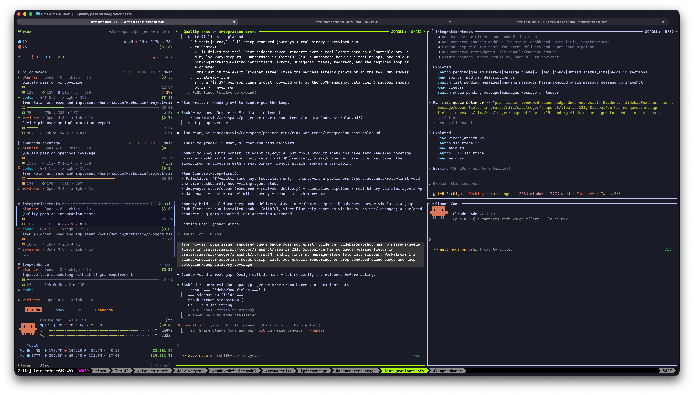

# Teams

A team launches several agents as one unit, each in a named role with its own context window, model, and instructions, cooperating over messages in a shared channel.

<p align="center">
  
  <br/><sub>The loop mid-conversation: <code>@coder</code> finds a gap in the plan and messages <code>@planner</code> with evidence; the planner (center pane) verifies and updates the plan.</sub>
</p>

Define the roles once in `teams/<name>.md`, then launch the whole set with one name; each member answers to its own role handle. For a one-off pairing, put [roles directly in the layout spec](./fleet.md#compose-a-layout) with `cell:role`; a role set earns a named team when it recurs. You compose the roles the way the work splits — the shipped `forge` team, one split that works really well, pairs a planner, a coder, and a reviewer on one feature.

```sh
rimz teams forge -w feat-complex          # planner, coder, reviewer on one feature
rimz message @planner "ship the plan"     # each member answers to its role handle
rimz teams resume forge                   # reopen the newest closed forge team
```

## Why split the work

Every agent works inside one context window, and everything it does fills it: files read, tool output, discussion, dead ends. A filling window costs more per turn and reasons less sharply, so the window is the real budget a long task runs against. And inside the window, attention is the scarcer resource still: a model weighs everything it holds against everything else, and when everything claims importance, nothing receives it.

Subagents are the first tool against that, and a good one. The parent dispatches an explore subagent to locate the relevant code and folds back a summary instead of the whole search; plan subagents draft competing directions in parallel. Provider-native children and pane-backed children launched through [`rimz subagents`](../reference/cli/subagents.md) share that product role: one parent delegates bounded work and collects the result. The pane-backed form adds a durable petname, result joins, and lifecycle control, but it is still a supervised one-prompt assignment rather than a peer conversation.

A team splits the task itself across independent windows:

- Each member keeps its own context and its own attention, the way specialists on a human team do. Each member still uses its own subagents, so a team stacks on that architecture rather than replacing it.
- Each member can run a different provider. Model capability is jagged (brilliant at one kind of work, mediocre at the next), the peaks and valleys sit in different places per model, and each model has a comfort zone shaped by its size and training. Matching phases of the work to models lets one model's peak cover another's valley: better results for fewer tokens.
- Members talk both ways, over as many rounds as the work needs: a downstream role can ask, push back, and escalate. A supervised subagent remains parent-directed; messages can park against its address, but v1 does not wake a finished child into another round.

That is what a team manages: which window holds which part of the problem, and what each window's attention is spent on. The split itself is yours to design: two roles or five, one provider or several, whatever shape the work divides into. The rest of this page walks one split that has proven itself.

## The forge loop

`forge` is the team RimZ builds itself with, shipped ready to copy under [`examples/teams/forge/`](https://github.com/rimio-ai/rimz/tree/main/examples/teams): three roles that carry one change through plan, code, and review, each role a profile with its own model, effort, and system-prompt file. Two siblings ship beside it for the other shapes of work — `mill`, which leads with an architect on a refactor that has to remove surface, and `spot`, a coder and a reviewer on a fix with no design left to do — and both run the machinery this section describes. The [teams README](https://github.com/rimio-ai/rimz/tree/main/examples/teams) covers all three.

- **@planner** (Claude, on Fable) talks with you. It explores the code through subagents, drafts directions, confirms the design choices with you, and writes the plan. Planning is where a deep model earns its price: Fable reads the intention behind a question, holds a large design in view, and writes implementation plans precise enough to execute. On a complex problem that conversation alone fills 200k to 300k tokens, and by hand-off the window holds the whole design history: the exploration, the alternatives weighed, your decisions. That context is exactly what good design calls for, and exactly what execution doesn't need. Asking the same window to also type the code would push it toward 400k to 600k tokens, where every turn gets slower and pricier and a big model's reasoning starts to dull.
- **@coder** (Codex, on Astra, the current GPT) starts fresh from the plan: a clean window, the exact files to touch, the decisions already made. Astra is fast, cheap, and writes robust code once the details are pinned down, and a precise plan makes its context loading precise too: it pulls in just the code the change touches and implements from there. It verifies the plan against the real code as it goes rather than trusting it.
- **@reviewer** (Claude, on Opus) is a third fresh window. It reads the plan, reviews the full diff blind before opening the coder's report, so its findings form from the code rather than the coder's narrative, then reconciles that report claim by claim.

By the time implementation starts, two windows understand the problem from different sides: the planner's holds the design history, the coder's holds the code as it stands, and each catches what the other misses. So the roles keep talking. The coder hits a choice the plan left open and takes it to the planner, whose full design context makes it the right desk for the call. Coder and reviewer argue findings with `file:line` evidence, fix or push back, and escalate to the planner when a dispute turns out to be a design call. Three independent windows, each with its own focus, cooperating as one team.

The split reads like it should multiply cost; in practice it divides it. Building RimZ with forge, a complex change that a single Fable window would carry to 400k or 500k tokens and well past $100 lands around $10 of planning, $20 of coding, and $10 of review, and the quality rises as the price falls, because each window spends its whole budget inside its comfort zone.

## Set up forge

Install the release-matched bundle from GitHub, then launch it into a worktree:

```sh
rimz teams install forge
rimz teams forge -w feat-complex            # the whole team, one isolated worktree
```

From a repository checkout, copy the team and its direct definitions when you want to edit that checkout's version directly:

```sh
mkdir -p ~/.rimz/teams ~/.rimz/agents
cp examples/teams/forge/forge.md ~/.rimz/teams/
cp examples/teams/forge/agents/*.md ~/.rimz/agents/
rimz agents validate
```

Then hand the task to the planner and let the loop carry it: type into the planner's pane, or message it.

```sh
rimz message @planner "add rate limiting to the ingest API"
```

The planner comes back to you at its design gates; the sidebar lifts the whole team the moment any role needs you ([one team, one line of work](#one-team-one-line-of-work)). The `claude` and `codex` CLIs must be on `PATH`; models, feature flags, and the rest of the install fine print are in the [examples README](../../examples/README.md#agent-teams--teams).

## See and drive your teams

To follow a staged run without opening each pane, read the [sidebar pipeline line](./sidebar.md#the-agent-cards) below its worktree header. It shows the board's stage and elapsed run time; click it to reach the stage owner. Unlike the stage age in `teams show`, this clock covers the whole run and stops at `Done`.

When several copies of a team are working in parallel, checking each pane loses the overview. The team catalogue gives each live cohort its own row with lane, stage, PR/CI, and status; `show` opens the detail for one line of work:

```sh
rimz teams                              # every definition and live instance
rimz teams show forge#feat-query        # stage, liveness, PR/CI, members, signal fires, memory files
rimz teams show forge                   # the definition, then one row per live cohort
rimz teams show '#feat-query'           # every team live in this lane
rimz teams forge -w feat-query          # launch or reconcile one cohort
rimz teams resume forge                 # reopen its newest closed cohort
rimz teams focus forge                  # jump to the role that needs attention
rimz teams restart forge                # restart every role in declared order
rimz teams stop forge                   # close the whole live cohort
rimz teams wait forge#feat-query        # block until the board reaches Done, then print its Result
```

Add `--json` to `rimz teams` or `show` for the structured report. Named-team inspection returns one record; lane-only inspection returns an array of team records.
The bare team name and the longer `launch` form use the same reconciliation engine as `rimz agents <team>`, while `resume`, `focus`, `restart`, and `stop` keep the cohort lifecycle together.

Fresh launches that open a new pane or tab print the worktree lane, absolute path, `board blackboard.md`, and each member's handle and resolved model, marking the effective leader with `<- leader`. When signal bindings are configured, a `signals` line closes the member list. If you supplied a task, the receipt names its recipient and echoes a shortened version of that prompt. This tells you how the team was launched, not whether its providers are ready: startup is asynchronous, and members may not yet appear in `teams show`.

Run `rimz teams show forge#feat-query` to check on a run. It leads with what that question needs: the cohort's state and, unless it is working, how long since any member did anything; a `stage:` line with how long the board has sat in that stage (`Done for 2h` once finished); the pipeline and PR/CI; then each member's status, time since last activity, activity, context fill, and cost; and whether each armed signal subscription has fired. The definition follows at the end. `rimz teams show forge` answers the other question, what the team is: the definition first, then one row per live cohort with its stage, PR, and state. The lane report shows the absolute worktree path once and lists existing memory files relative to the worktree with line counts and modification ages, so you can open the board or notes directly rather than read every pane. The isolation line shows the members' isolation (the `--isolation` given at launch, else the machine setting) and their temporary directory. Stage comes from the `Stage:` line that `rimz teams flip` updates in the worktree's `blackboard.md`; it is an advisory progress note, not a state inferred from idle or running agents. PR/CI reflects the room's cached observations, not a fresh forge query; `none` means no PR information is available in the report, not a verified absence of a PR.

Use `rimz message @planner#feat-query '<text>'` to message the leader. To block a shell or script until the work is done, run `rimz teams wait forge#feat-query`: it returns when the board reaches `Done` (at once if it already has), prints the board's Result section, and exits `1` if the cohort ends first ([teams reference](../reference/cli/teams.md#wait-for-a-cohort-to-finish)). An agent that must end its turn while it waits arms a signal subscription on the cohort's next idle transition instead:

```sh
rimz loop add team-idle --wait @me --signal team.idle --match instance=forge#feat-query --once
```

This arms a future notification, not a startup or completion barrier. Signals are transition-only and never replay: if the team was already idle before you armed the subscription, that event is missed. Check current state too, and do not treat idle as proof that the work is complete. The [loop reference](../reference/cli/loop.md#signals) covers signal subscriptions and delivery.

When the same team is live in several lanes, run the lifecycle command inside the lane you mean or select it with `team#worktree` or `-w NAME`.
The `COST` in `rimz teams show`, the team's collapsed finished sidebar receipt, and attribution use the same all-in lifetime fold across every resumed session of each role and every subagent it spawned. Attribution's `subagents` line breaks that spend down by task. Expanding a finished receipt puts each role's lifetime cost on its card, and those cards add back to the receipt; live cards remain scoped to the current provider session.
All three figures cover the worktree's current life, so a name reused by a later cohort in a recreated worktree reports that cohort alone, and a removed worktree contributes nothing anywhere.
Use [`rimz agents attribution --md`](../reference/cli/agents.md#attribution) when the team's pull request is ready; it credits contributing roles observed on the checkout's current branch, including members that exited before the PR opened. Add `--branch BRANCH` to credit another branch; this branch filter applies only to attribution, not team or sidebar lifetime costs.
The full flag surface lives in the [teams CLI reference](../reference/cli/teams.md).

## Define your own team

A team puts a repeatable division of work in one file, `teams/<name>.md`. Its roles select direct definitions from `agents/`; its Markdown body tells the seats how to work together. Start with the installed forge definitions, then adapt the roster and pipeline:

```markdown
---
name: forge
leader: planner
layout: planner,coder+reviewer
stages: [Explore, Plan, Implement, Review, Submit, Reflect]
roles:
  - agent: planner
    owns: [Explore, Plan, Reflect]
  - agent: coder
    owns: [Implement]
  - agent: reviewer
    owns: [Review, Submit]
---
Keep the board current. Route implementation to @coder and independent review to @reviewer.
Send decisions requiring the user to @planner.
```

Each selected definition and its kind base must exist. Put shared provider instructions in `agents/<kind>.md`, role craft in the direct definition's body, and the workflow in the team's body. RimZ composes base → ancestor crafts → seat craft → built-in consensus → pipeline; read the consensus in its [read-only copy](../reference/definitions.md#the-built-in-consensus-copy) at `~/.rimz/teams/consensus.md`. Role fields can override model, tools, and other settings; the [definition reference](../reference/definitions.md#teams-and-seats) lists the supported keys. Run `rimz agents validate` before launching.

Every stage needs exactly one owner, and Implement and Review need different owners. `Done` is implicit and never declared or owned. The first `rimz teams flip` creates `blackboard.md` if absent; the leader fills in the goal and the team maintains its notes. The leader receives the initial task and remains the user-facing seat; other seats lose the question tool.

The team uses `/blackboard.md` and `/*-notes.md` as ephemeral-memory patterns. Launch and resume add missing patterns to the repository's `.git/info/exclude`, commonly shared by linked worktrees. Remove those lines to undo the exclusions. Excluded scratch files do not keep a worktree dirty and are deleted with it during cleanup.

Launching the team opens every member in its layout. Members answer to `@<role>` within the channel; `rimz agents forge.reviewer` launches or re-adds just that seat. A team launched by another agent is still a top-level peer cohort, not a supervised child. To retire a definition, stop its live cohort and remove its Markdown file; direct definitions shared by other teams can stay.

### Hand off with one command

Editing the board and separately messaging the next owner leaves two steps to forget. Once your stage's work is saved, hand it off with one command:

```sh
rimz teams flip Implement "plan ready in plan-notes.md; three advisories carried in"
```

RimZ updates the worktree's `blackboard.md` Stage line, appends the required progress note to `## Progress`, records the stage opening, and sends a prose `Type: STAGE` notice to the configured owner at its next turn boundary. The note records where the work stands, not a request to the receiver; no separate message is needed. Run the command in the team's worktree, and use `--team NAME` if several teams live there. Use exact stage names and put qualifiers in the note. Handing your own stage to another role requires a clean worktree: commit or discard what `git status` lists first, or the flip is refused with those paths; your own flip from outside the team is not held to this. To correct a hand-off, flip back to the intended stage; both actions stay in the ledger. `rimz teams flip Done "reflection recorded; run complete"` closes the board without waking anyone.

The launch reminder distinguishes three starts: a fresh worktree has no board, so the leader writes `blackboard.md` with the Goal and the empty sections, then opens the first stage with `rimz teams flip Explore "board opened; sweep aimed at the request"`; an unfinished board is a continuation, with its owner woken to reread it while everyone else rests; a board at `Done` belongs to a finished run, so the leader either clears the old board and memory files for a new request or keeps them and flips out of `Done` for a follow-up. On resume or restart, the current owner's registration re-wait says nothing flipped since the last Progress line; it adds no ledger entry.

Markdown roles default to `flip-compact: 120k` when they own Plan, or `180k` otherwise; a role can override that threshold. After it leaves a stage it owns for one another role owns, RimZ compacts its own context at the next turn boundary only if occupied context has reached the threshold. The threshold is checked before pane availability; below-threshold flips make no attempt and write no assist record. Moving between stages it owns, or flipping to `Done`, does not compact. Set the role to `"off"` to disable it; removing the override restores the Markdown role default. A skipped compaction does not fail the hand-off. A team member's compaction uses the [team brief](./configuration.md#smart-compaction), which leaves the board and stage files to carry the run, unless `compact_instruction` is set. See the [command reference](../reference/cli/teams.md#flip-the-board-to-the-next-stage) for selection, delivery, and recovery details.

### Send events to the responsible role

A PR script knows who pushed, not who owns the repair. Declare signals on the role that receives them, so a failed check reaches the coder without the reviewer relaying it:

```yaml
# Within the coder role mapping:
signals:
  - ci.failed
```

Launch with `rimz teams forge -w feat-x`, or from an existing linked worktree. RimZ refuses a fresh root-checkout launch of this binding because its forge poll watches worktree branches; an explicit branch or worktree-path match is the alternative. When the coder registers, RimZ writes a standing subscription pinned to that session and scoped to its worktree. Failed CI sends the coder a `Type: SIGNAL` message with the branch, PR when known, and event payload. A busy coder takes it at the next turn boundary; this is not a self-alarm interrupt.

`rimz teams show forge#feat-x` separates declared bindings from live subscriptions. Resume, restart, and re-adding a role arm at registration too; subagents do not inherit bindings. Stopping or losing the session removes its subscriptions, and missed signals are not replayed. Use `rimz loop remove <name>` to remove an individual subscription or `rimz teams stop forge#feat-x` to stop the cohort. The rows live in workspace state, not the team file.

## Relaunch reconciles instead of duplicating

Point any co-launched layout — a named team or an inline multi-agent spec — at an explicit worktree name, and RimZ reads the state first: a live cohort focuses its tab, and a closed cohort asks what you want done with the worktree it left behind.

`rimz agents claude:planner,codex:coder -w feat-once` focuses the existing pair when the same command runs again.

When the cohort is closed and the tree still carries work, `rimz teams forge -w feat-rate-limits` asks whether to resume the team's closed sessions, launch new agents into the same checkout, or cancel, offering `(resume/fresh/cancel)` with `resume` as the default.

Choose `fresh` when you want new sessions without losing the previous run's work. The branch, uncommitted changes, and declared scratch files such as `blackboard.md` and `plan-notes.md` stay in the same checkout. The new members receive a reminder of existing scratch files so they can read the old run before acting.

When the tree is instead clean and its content has landed, the choices are `remove`, `fresh`, and `cancel`, defaulting to `cancel`, because removing a merged worktree deletes the checkout and its branch. Pressing Enter takes the default, and any answer the prompt does not recognize cancels.

`rimz teams forge -w feat-rate-limits --fresh` (or `rimz agents claude:planner,codex:coder -w feat-once --fresh`) skips the prompt and takes the fresh path directly, which is also what a non-interactive run prints as the command to use. It needs the worktree named, and it never duplicates a live cohort: if the team is still running there, the command focuses it as usual.

`--resume` (alias `--continue`) forces the resume path, reopening the newest matching set of sessions: by team name and role for a team, or by cell order for an inline spec. Resume keeps identity, working directory, and channel and reads each role's settings from its current profile. To move a closed team out of the sandbox without losing its conversations, run `rimz teams resume forge --isolation host` (or `rimz teams forge --resume --isolation host`); the new isolation is recorded for later relaunches and children. Omitting the flag keeps the recorded isolation. Per-run permission, model, and effort changes use [`rimz agents forge --resume`](../reference/cli/agents.md#resume-a-cohort). A prompt cannot ride with resume: send it afterward with `rimz message`, or choose fresh at the worktree prompt. Channel changes remain refused.

For one agent, a kind resumes its newest closed root conversation; a profile such as `rimz agents astra --resume` selects only conversations launched from that profile. Subagents never compete with their parent, and a matching root that is still live refuses the command.

```sh
rimz teams resume forge            # reopen the newest closed forge team
rimz agents claude,codex --resume  # reopen the newest matching inline pair
rimz agents claude --resume        # resume the freshest closed Claude session
```

When the place is easier to name than the spec, `rimz agents resume '#feat-x'` restores the lane's saved team layout and stray agents without requiring the team name. This place-first form converges a partially live team by adding only its closed members; the spec-first `--resume` form selects a cohort by team or layout.

## One team, one line of work

The room treats a team as a single line of work: the sidebar names the active group with `· <team>`, keeps its members as one contiguous block with one derived state, and lets one member asking for you lift the whole block ([the sidebar guide → Teams read as one](./sidebar.md#teams-read-as-one)).

## See also

- [Agents](./fleet.md) — launch agents by name and compose the layout a team fills.
- [Worktrees](./worktrees.md) — isolate a team on its own branch for parallel work.
- [Messaging](./messaging.md) — reach a role by handle: park, steer, schedule, and channels.
- [Examples → forge](../../examples/README.md) — the shipped forge definitions: install, prerequisites, and try-before-install.
- [Configuration → profiles and teams](./configuration.md#agent-profiles-commands-and-teams) — where reusable profiles and teams live.
- [Teams CLI reference](../reference/cli/teams.md) — discover, inspect, install, launch, resume, and drive named teams.
- [Agent-control reference](../reference/cli/agents.md) — the complete `rimz agents` surface.
