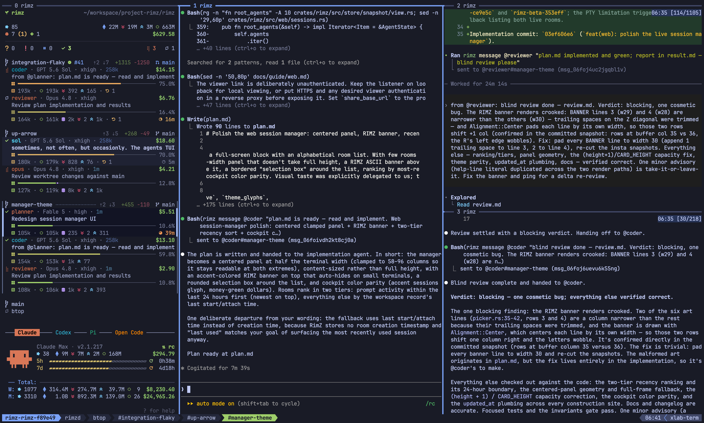
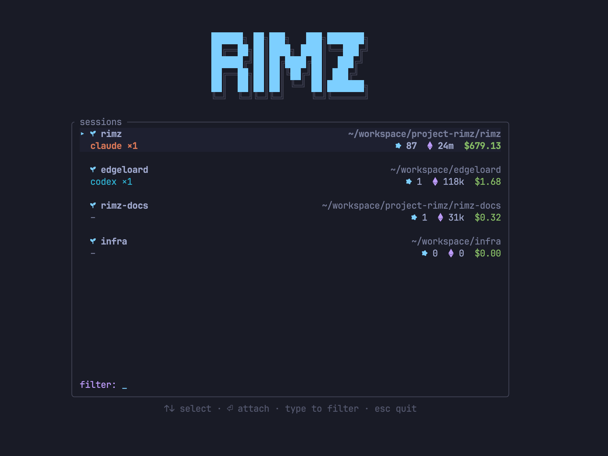

# Web

A room is a plain Zellij or tmux session, so `ssh dev` and `tmux attach` reach it from any machine that has your key and a terminal you trust. That covers most days. It stops covering the day you are on a borrowed laptop, a phone, or a locked-down machine with no SSH client, or the moment you want the room in a tab beside the pull request.

You could serve a terminal over HTTP yourself with [ttyd](https://github.com/tsl0922/ttyd), which does exactly that in one command. Authentication, deciding which session a URL reaches, and the font are then yours to solve. `rimz web` keeps ttyd and solves those three. It puts the room you already have behind one authenticated local address, sidebar and theme intact, and moves nothing: the session stays where it is, the agents keep running, and a terminal can stay attached to the same room at the same time.

<p align="center">
  
  <br/><sub>The same room, in a browser tab: sidebar, agent panes, theme, and pixel rendering all carry over.</sub>
</p>

## Install ttyd on the serving machine

Browser access needs ttyd 1.7.5 or newer on the machine that serves the room, for Zellij and tmux alike:

```sh
brew install ttyd     # macOS or Linuxbrew
ttyd --version        # RimZ needs 1.7.5 or newer
```

`brew upgrade ttyd` fixes an older Homebrew build. On Debian or Ubuntu, read `apt-cache policy ttyd` first and install from apt only when the candidate is 1.7.5 or newer; otherwise take a binary from the [ttyd releases](https://github.com/tsl0922/ttyd/releases). In a tmux room, `rimz doctor` prints the resolved binary and version on a `ttyd web` row.

The commands that start or use the daemon (`rimz web open`, `share`, `start`, `restart`) refuse a missing or older binary and name the install or upgrade. `rimz start` only warns, because browser access at start is best-effort: the terminal room opens either way.

## Serve a local room

```sh
rimz web          # open this directory's room in a browser
rimz web url      # print a room's URL without starting anything
rimz web status   # what is listening, and which rooms are shared
rimz web stop     # stop every ttyd daemon RimZ started
```

`rimz web` is `rimz web open`. It does five things you could do by hand:

1. Resolve the room for the current directory, or for `--session <name>`. A room that is not running is started here, exactly as `rimz start` does without attaching, and recovers the agents it had; `--no-resume` brings it up empty instead.
2. Wait up to five seconds for the session to appear under Zellij or tmux.
3. Ensure the shared daemon: one ttyd process on `127.0.0.1:8200` serving every Zellij and tmux room on the machine, so the second room costs nothing.
4. Print the room's URL on stdout and the browser password on stderr.
5. Open your browser.

`--print` stops before the last step, which is how you capture the URL:

```console
$ rimz web open --print
http://127.0.0.1:8200/?room=rimz-query-engine-a1b2c3
ttyd basic auth for this machine: user rimz, password <secret>
```

The browser then asks for Basic credentials: the user is `rimz`, and the password is the one on that stderr line. There is one credential per machine, minted the first time the shared daemon starts and kept under `~/.rimz/web/` with mode 0600, and it never appears in a URL.

Rotate it with `rimz web token create`, which restarts the daemon, so open tabs drop and come back asking for the new password. `rimz web token revoke-all` stops the daemon and deletes the credential; the next `rimz web` mints a fresh one.

Editing `?room=` in the address bar is how you switch rooms. RimZ validates that argument before attaching and accepts only a live session with a RimZ workspace record, so no value of it can run an arbitrary command; an unrecognized name lands in the [session manager](#session-manager). The browser attaches as one more client on the session, so a terminal already attached to that room stays attached and both see the same panes.

Safari can load the direct local page but never attaches the terminal: WebKit omits Basic credentials from WebSocket upgrades. Open the URL in Chrome, or reach the room through [`rimz remote connect --web`](#open-a-remote-room) or a [reverse proxy](#behind-a-reverse-proxy), both of which supply the credential before the browser has to.

`rimz web stop` stops every ttyd daemon RimZ started and touches nothing else: the rooms keep running, and the credential and the list of shared rooms both survive. To end browser access rather than pause it, revoke the credential as well and set `enabled = false` under `[web]`. With the default `enabled = true`, every `rimz start` also brings the shared daemon up best-effort; a missing ttyd, an occupied port, or a daemon error warns on stderr and leaves the room usable in the terminal.

## Session manager

Open the address without a `?room=` argument and you get a picker of every live RimZ room on the machine rather than one room. You land there too when the argument names a room that has stopped or that RimZ does not know, with a notice saying which. It is the same manager `rimz sessions` opens in a terminal.

<p align="center">
  
  <br/><sub>Every live room as a card: provider agent counts on the left, sessions, tokens, and spend on the right.</sub>
</p>

Each room is a two-line card. The first line is the repository name and its path. The second carries live agent counts by kind (`claude ×2`) on the left, with a red `●` for agents waiting on you, and the sessions, tokens, and spend of the sidebar's headline window on the right ([the marks](./insight.md#the-marks-you-read-everywhere)). Rooms prompted in the last 24 hours lead, newest first.

Move with the arrows, `j`/`k`, or the wheel, attach with Enter or a second click on the selected card, and type to filter on repository name and path. `n` opens a second list of workspaces that are not running, so you can start a room from here rather than from a terminal. The [session reference](../reference/cli/getting-started.md#pick-a-session) has the full key tables.

Attaching rewrites the address to that room's `?room=` and the tab title to `<repo> · RimZ`, where the manager itself reads `RimZ`. A refresh or a dropped connection reconnects straight back into the room. Detaching with your multiplexer's detach key returns you to the manager and makes it the reconnect target again.

## Open a remote room

The room lives on a dev box and you would rather not expose a listener on it. `--web` gives you the same browser room over the SSH link you already use:

```sh
rimz remote connect dev --web
rimz remote connect dev --web --web-port 8443
```

```console
$ rimz remote connect dev --web
http://127.0.0.1:8368/?room=rimz-query-engine-a1b2c3
rimz: tunnel up — reconnects automatically; Ctrl-C stops
```

One SSH call starts or resumes the remote room and ensures the host's shared daemon. RimZ then opens an ephemeral SSH forward to the host's ttyd listener and serves the local URL through a relay that adds the host's credential to every page and WebSocket request. The browser sees no password prompt, which is also why Safari works on this path. Nothing new listens on the host, and the local port binds `127.0.0.1` only.

The command holds the foreground until Ctrl-C and follows the same recovery as a terminal connection: a reconnect repeats the preparation, so a stopped daemon comes back and a rotated credential reaches the relay, and the local URL does not change. Without `--web-port`, the local port derives from the session name within 8300-8399 and moves to the next free one when it is busy, so a room keeps its URL between runs. The exact steps, the refusals, and what `--web` gives up are in the [remote reference](../reference/cli/remote.md#open-a-remote-room-in-the-browser).

## Share a read-only broadcast

Someone wants to watch a run: a colleague on a call, or a screen on the wall. Handing over the machine password would give them a keyboard in every room on the box, and a read-only credential is not an option, because ttyd's read-only mode belongs to a whole process rather than to one login. RimZ gives watchers a listener of their own instead.

```sh
rimz web share --print                            # share this room, print the viewer URL
rimz web share --session rimz-query-engine-a1b2c3
rimz web unshare                                  # revoke this room
rimz web unshare --all                            # revoke every room
```

`share` needs a room that is running now. It adds that one room to a list on disk, starts the broadcast daemon (a second ttyd process, on `127.0.0.1:8201`), and prints its viewer URL. That daemon has no password prompt and drops every keystroke, and it serves only the rooms on the list: a viewer who edits `?room=` gets the same `this room is not shared` for a name that is unknown, stopped, or merely unshared, so the list cannot be probed.

tmux viewers attach read-only and with `ignore-size`, so they can neither type nor pull the layout to their own window size. Zellij has neither mode: dropped input is the only barrier there, and a viewer resizing their window can change the shared room's geometry.

`unshare` on one room while others stay shared stops and restarts the broadcast daemon, which disconnects every viewer; tabs on still-shared rooms reconnect on their own. Removing the last room, or `--all`, stops the daemon outright. The list itself survives `rimz web stop` and a reboot, so the next `share` or `rimz web restart` serves the same rooms again, and `rimz web status` prints it whether or not the daemon is up.

The viewer link is unauthenticated by design. Keep the listener on loopback for someone sitting beside you, and put HTTPS and whatever viewer check you want in a reverse proxy before it leaves the machine, with `share_base_url` set to the proxy's public prefix. The reverse-proxy settings below guard the shared daemon and never reach this listener. Sharing a room while `interface` is not loopback prints `rimz: warning: broadcast is unauthenticated; anyone reaching <interface>:<port> can watch`.

## Browser appearance and input

The browser room inherits your RimZ [theme](./theme.md) and a font RimZ provisions for it. `JetBrainsMono Nerd Font Mono` (the default) and `CaskaydiaCove Nerd Font Mono` are built in: RimZ downloads verified regular and bold faces once and caches them under `~/.rimz/cache/web-fonts`. `font_source` instead names one local `.ttf`, `.otf`, `.woff`, or `.woff2` file, or an HTTPS URL to one, up to 16 MiB. A family with neither a preset nor a source is passed to the browser to resolve from installed fonts.

When a face cannot be fetched or read, RimZ warns on stderr and leaves your family first in the browser's font stack, so the tab falls back to a locally installed copy and only then to monospace. `style_client = false` drops the colors and the downloaded font while keeping the input handling.

RimZ serves its own page in front of xterm.js so that browser keys behave like terminal keys. Shift+Enter reaches an agent as a soft newline, macOS Option chords arrive as Meta rather than as composed accents, tmux copy-mode yanks and Shift-drag selections reach the system clipboard, and the cursor holds the shape the pane asked for instead of blinking. Drag selection and pane-border resizes stay responsive under heavy tmux output, and the scroll wheel stops turning into arrow keys mid-attach. In tmux rooms that meet the [pixel tier](./pets.md#crisp-pixels-and-cell-art)'s requirements, the page also draws pets and context meters as crisp pixels rather than cell art. [Web internals](../internals/web.md#what-the-bootstrap-does) lists everything it installs.

When RimZ cannot build that page it warns as the daemon starts (`rimz: skipping browser terminal fixes: ...`) and ttyd serves its stock one instead: no theme, no downloaded font, none of the input handling, and `?room=` ignored, so every room link lands in the [session manager](#session-manager) and you pick the room from there.

Appearance is fixed when the daemon starts, so after a `[theme]` or `[web]` styling change:

```sh
rimz web restart
```

`restart` starts the shared daemon when it was down, and restarts the broadcast daemon when rooms are shared. Reload any tab that stayed open: it keeps the page it already loaded.

## Behind a reverse proxy

Handing out the machine password does not scale past yourself. Put an authenticating proxy in front instead: it terminates HTTPS, applies your identity provider's decision, and passes RimZ a header naming the user it let through.

Setting `auth_header` changes the shape of what RimZ runs. ttyd moves to an ephemeral loopback port with its Basic Auth intact, and a small RimZ gate takes over the configured listener. The gate is the only thing your proxy talks to.

```toml
[web]
base_url = "https://shell.example.com/rimz"
auth_header = "X-Authentik-Username"
auth_users = ["alice"]
interface = "0.0.0.0"
trusted_proxies = ["172.18.0.0/16"]
```

`base_url` is the public prefix RimZ prints in place of `http://127.0.0.1:8200`; the `/?room=<session>` part stays. Leave `interface` and `trusted_proxies` out when the proxy runs on the same host and arrives over loopback.

The block above is for a proxy that arrives from elsewhere, such as Traefik in a container reaching the host across a Docker bridge: `interface = "0.0.0.0"` exposes the listener, and `trusted_proxies` admits that bridge's CIDR alone. It matches the TCP peer address, so configure the address that actually arrives after container and host networking, and point the host firewall at the same sources.

On every HTTP request, the gate:

- checks the peer address against `trusted_proxies`, admitting loopback always, so an empty list admits loopback alone;
- requires exactly one non-empty `auth_header`, rejecting a missing, empty, or duplicated one;
- compares that header's trimmed value against the trimmed entries of `auth_users`, exactly and case-sensitively, where an empty `auth_users` accepts any single non-empty identity;
- strips any `Authorization` the client sent and presents ttyd's own Basic credential upstream.

Make the proxy overwrite or remove any client-supplied copy of the identity header before it forwards. Your identity provider's access policy on the RimZ application is the real control over who reaches the gate; `auth_users` is a second check at the terminal itself, spelled the way the provider emits its canonical usernames. With Authentik behind Traefik, that means returning `X-Authentik-Username` from the forward-auth middleware and attaching the middleware to the router that serves RimZ.

RimZ warns at daemon start when the shape is unsafe: `auth_header` on a non-loopback interface with an empty `trusted_proxies` prints `trusted-header auth on <interface>:<port> accepts only loopback proxies` and names the key to add.

ttyd pings an idle tab once an hour, so set the proxy's idle read timeout above that or a genuinely idle tab is cut: for nginx, `proxy_read_timeout` above 3600 seconds. Cloudflare's 100-second timeout is not configurable on lower plans, so tabs behind those plans reattach periodically.

Run `rimz web restart` after any of these changes. `rimz remote connect --web` is unaffected: it tunnels to the private ttyd listener and injects the credential in its own local relay, so it behaves identically under Basic and trusted-header configurations.

## Security boundary

The credential is machine-wide. It authenticates the shared daemon rather than a room, so whoever holds it reaches every live RimZ room on the machine and has a shell as the serving user. Treat it like an SSH private key for the whole box, and treat an identity the gate admits the same way.

The broadcast listener has no authentication at all, and terminal output can carry secrets. Loopback or a reverse proxy, always.

A `--web` tunnel puts an unauthenticated loopback port on your own machine for as long as it runs, which is the trust boundary of `ssh -L`. On a shared client machine, host-level user isolation is what keeps it yours.

Before anything goes past loopback, the chain should read:

```text
browser -> HTTPS authenticating proxy -> RimZ gate -> Basic-authenticated loopback ttyd
```

[Security: browser listener](./security.md#browser-listener) states the whole boundary, including what the gate does and does not decide.

## See also

- [Remote](./remote.md): saved aliases, link health, and the rest of what rides the SSH connection.
- [Web CLI](../reference/cli/web.md): every subcommand, flag, refusal, and JSON payload.
- [Configuration](./configuration.md#web-access): the `[web]` keys and their defaults.
- [Security](./security.md#browser-listener): the browser listener's trust boundary in full.
- [Troubleshooting](./troubleshooting.md#ttyd-is-missing-too-old-or-a-browser-room-will-not-start): a browser room that will not come up.
- [Web internals](../internals/web.md): the daemon argv, its state files, and the remote wire format.
